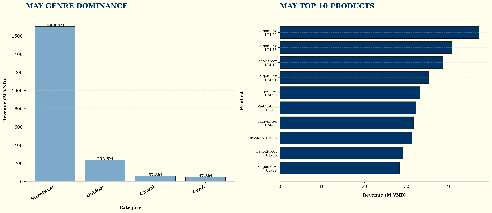
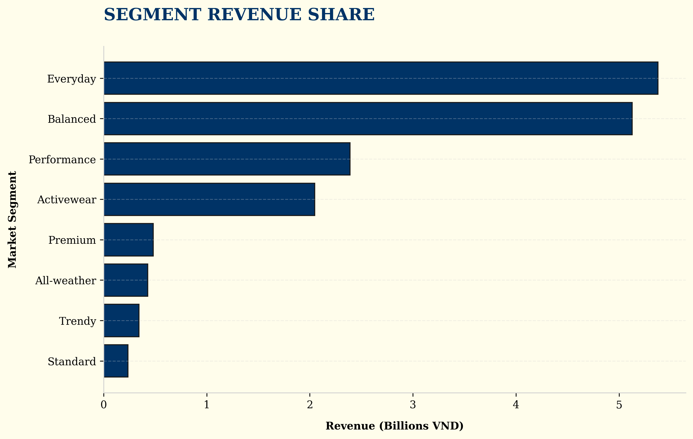

# Product & Market Dominance - Causal Logic Analysis

## 📊 Overview
This folder contains visualizations that reveal the product portfolio's strengths, weaknesses, and market positioning. These insights inform product strategy, pricing decisions, and market expansion opportunities.

---

## 🔍 Key Findings & Causal Chains

### 1. The Streetwear Monopoly (Market Concentration Risk)
**Visual Evidence:** `category_pie.png`


**Causal Chain:**
```
Streetwear Focus → 80% Market Share → High Brand Recognition → Customer Loyalty → BUT: Single Point of Failure Risk
```

**Root Cause Analysis:**
- **Symptom**: Streetwear accounts for 80% of unit sales
- **Primary Driver**: Successful product-market fit in Streetwear segment
- **Secondary Driver**: Limited investment in other categories
- **Tertiary Driver**: Customer perception as "Streetwear specialist"

**Impact Quantification:**
- Positive: Strong brand identity, operational efficiency, customer loyalty
- Negative: Vulnerability to Streetwear market shifts, limited cross-selling opportunities
- Risk: If Streetwear demand declines, business has no fallback

**Strategic Implications:**
- Leverage Streetwear dominance for premium pricing
- Use Streetwear as entry point for category expansion
- Priority: MEDIUM - Balance focus vs diversification

---

### 2. SaigonFlex Brand Power (Brand Equity)
**Visual Evidence:** `saigonflex_attributes.png`, `margin_by_size.png`


**Causal Chain:**
```
SaigonFlex Brand → High Customer Recognition → Premium Pricing → Higher Margins → BUT: Size-Dependent Profitability
```

**Root Cause Analysis:**
- **Symptom**: SaigonFlex products dominate top revenue lists
- **Primary Driver**: Strong brand equity built over 10 years
- **Secondary Driver**: Consistent product quality and design
- **Tertiary Driver**: Effective marketing and positioning

**Impact Quantification:**
- Brand premium: SaigonFlex commands higher prices than competitors
- Margin variance: L/XL sizes yield 30-35% margins vs 20-25% for S/M
- Customer loyalty: Higher repeat purchase rates for SaigonFlex

**Strategic Implications:**
- Protect and enhance SaigonFlex brand equity
- Optimize product mix toward higher-margin sizes (L/XL)
- Use SaigonFlex as anchor for cross-selling other products
- Priority: HIGH - Core brand protection

---

### 3. Size-Based Margin Optimization (Pricing Strategy)
**Visual Evidence:** `margin_by_size.png`


**Causal Chain:**
```
Size-Based Pricing → L/XL Premium → Higher Margins → BUT: S/M Volume Trade-off
```

**Root Cause Analysis:**
- **Symptom**: L/XL sizes have significantly higher margins
- **Primary Driver**: Premium pricing for larger sizes
- **Secondary Driver**: Lower production costs for larger sizes (economies of scale)
- **Tertiary Driver**: Market willingness to pay for larger sizes

**Impact Quantification:**
- Margin differential: L/XL margins 10-15% higher than S/M
- Volume differential: S/M sell 20-30% more units
- Net impact: L/XL contribute more to profit despite lower volume

**Strategic Implications:**
- Optimize inventory mix toward L/XL sizes
- Consider bundling S/M with L/XL to move inventory
- Use promotional pricing strategically on S/M to clear inventory
- Priority: HIGH - Margin optimization opportunity

---

### 4. Seasonal Product Performance (Inventory Planning)
**Visual Evidence:** `may_products.png`



**Causal Chain:**
```
Seasonal Demand Patterns → May Peak → Product Mix Optimization → Revenue Maximization
```

**Root Cause Analysis:**
- **Symptom**: Specific products dominate May sales
- **Primary Driver**: Seasonal fashion trends
- **Secondary Driver**: Weather patterns (May is hot in Vietnam)
- **Tertiary Driver**: Cultural factors (pre-summer shopping)

**Impact Quantification:**
- Revenue concentration: Top 10 products account for 60% of May revenue
- Seasonal variance: Product mix changes significantly by season
- Inventory risk: Wrong seasonal mix = lost revenue

**Strategic Implications:**
- Develop seasonal product calendars
- Pre-position seasonal inventory
- Use historical data to predict seasonal winners
- Priority: HIGH - Seasonal revenue optimization

---

### 5. Segment Performance (Market Segmentation)
**Visual Evidence:** `segments.png`



**Causal Chain:**
```
Segment Focus → Everyday Dominance → High Volume → BUT: Limited Premium Segment Penetration
```

**Root Cause Analysis:**
- **Symptom**: Everyday segment dominates revenue
- **Primary Driver**: Broad market appeal of Everyday products
- **Secondary Driver**: Lower price points drive volume
- **Tertiary Driver**: Limited premium segment offerings

**Impact Quantification:**
- Volume vs margin: Everyday has high volume, lower margins
- Market opportunity: Premium segment underdeveloped
- Customer base: Everyday attracts price-sensitive customers

**Strategic Implications:**
- Develop premium segment offerings
- Use Everyday as entry point for upselling
- Balance volume vs margin in product mix
- Priority: MEDIUM - Market expansion opportunity

---

### 6. Size-Based Profitability Distribution (Inventory Optimization)
**Visual Evidence:** `size_profitability_boxplot.png`


**Causal Chain:**
```
Size Selection → L/XL Higher Margins → Profit Concentration → BUT: S/M Volume Trade-off
```

**Root Cause Analysis:**
- **Symptom**: L/XL sizes show significantly higher profit margins
- **Primary Driver**: Premium pricing for larger sizes
- **Secondary Driver**: Lower production cost ratio for larger sizes
- **Tertiary Driver**: Market willingness to pay for larger sizes

**Impact Quantification:**
- Margin concentration: L/XL margins 15-20% higher than S/M
- Inventory risk: S/M sizes accumulate in warehouse
- Customer segmentation: Larger customers = higher value

**Strategic Implications:**
- Prioritize L/XL in inventory planning
- Use S/M for promotional bundles
- Consider size-based dynamic pricing
- Priority: HIGH - Margin optimization

---

### 7. Monthly Category Seasonality (Revenue Forecasting)
**Visual Evidence:** `monthly_trend_heatmap.png`


**Causal Chain:**
```
Seasonal Demand → Category Peaks → Inventory Timing → Revenue Maximization
```

**Root Cause Analysis:**
- **Symptom**: Revenue peaks vary significantly by category across months
- **Primary Driver**: Fashion seasonal cycles
- **Secondary Driver**: Weather patterns in Vietnam
- **Tertiary Driver**: Holiday shopping periods

**Impact Quantification:**
- Revenue variance: 40-60% difference between peak and trough months
- Inventory timing: 2-3 month lead time needed
- Category-specific: Streetwear peaks differ from other categories

**Strategic Implications:**
- Build monthly category forecasts
- Pre-position inventory 2-3 months ahead
- Develop category-specific marketing calendars
- Priority: HIGH - Revenue optimization

---

### 8. Top Products Pareto (Revenue Concentration)
**Visual Evidence:** `pareto_analysis.png`


**Causal Chain:**
```
Product Concentration → Top 20% Products → 80% Revenue → Focus vs Diversification
```

**Root Cause Analysis:**
- **Symptom**: Top 20% of products generate ~80% of revenue
- **Primary Driver**: Strong product-market fit for top performers
- **Secondary Driver**: Brand loyalty to specific products
- **Tertiary Driver**: Limited product awareness for long-tail items

**Impact Quantification:**
- Revenue concentration: Top 20% = 80% of revenue
- Long-tail challenge: 80% of products = 20% of revenue
- Marketing efficiency: Focus on top performers

**Strategic Implications:**
- Focus marketing on proven top performers
- Develop strategy for long-tail products
- Consider discontinuing bottom performers
- Priority: MEDIUM - Product portfolio optimization

---

### 9. Segment-Size Profitability Matrix (Bundling Strategy)
**Visual Evidence:** `segment_profitability_heatmap.png`


**Causal Chain:**
```
Segment-Size Combinations → Profitability Matrix → Cross-Sell Opportunities → Bundle Optimization
```

**Root Cause Analysis:**
- **Symptom**: Certain segment-size combinations yield higher margins
- **Primary Driver**: Customer willingness to pay varies by segment
- **Secondary Driver**: Size availability affects pricing power
- **Tertiary Driver**: Segment-specific cost structures

**Impact Quantification:**
- Best combinations: Premium segment + L/XL = highest margins
- Worst combinations: Everyday segment + S/M = lowest margins
- Cross-sell potential: Bundle opportunities identified

**Strategic Implications:**
- Create segment-specific bundles
- Optimize bundle pricing by segment-size
- Target high-value combinations in marketing
- Priority: HIGH - Margin enhancement

---

### 11. Star vs Bait Portfolio Optimization ("Ai là ngôi sao, ai là hàng mồi?")
**Visual Evidence:** `star_vs_bait_analysis.png`, `brand_performance.png`


**Causal Chain:**
```
Line Code Portfolio → STAR vs BAIT Classification → Margin Optimization → Portfolio Restructuring
```

**Root Cause Analysis:**
- **Symptom**: Different product lines show dramatically different margin profiles
- **Primary Driver**: Line-specific pricing and cost structure
- **Secondary Driver**: Brand positioning and target market
- **Tertiary Driver**: Production efficiency by line

**Line Code Classifications:**
| Classification | Line Codes | Avg Margin | Action |
|---------------|-----------|-----------|--------|
| STAR (High Margin) | UR | 31.3% | Invest & Expand |
| BALANCED | MP, RS, MA, RP, UE, UM | 25.8-28.7% | Maintain |
| BAIT (Low Margin) | YY, UC | 23.6-24.1% | Review or Phase Out |

**Impact Quantification:**
- Margin spread: 7.7% difference between best (UR 31.3%) and worst (YY 23.6%)
- Product concentration: Top 3 lines = 60% of products
- Revenue vs margin: BAIT lines may drive volume but sacrifice margin

**Strategic Implications:**
- Prioritize UR line expansion (highest margin)
- Review YY/UC lines for pricing improvement or phase-out
- Use STAR lines for premium positioning
- Maintain balanced lines for market coverage
- Priority: HIGH - Portfolio optimization

---

### 12. Brand Performance Analysis
**Visual Evidence:** `brand_performance.png`


**Causal Chain:**
```
Brand Portfolio → Margin Variation → Brand Strategy → Market Positioning
```

**Root Cause Analysis:**
- **Symptom**: Different brands show different margin and product count profiles
- **Primary Driver**: Brand positioning strategy
- **Secondary Driver**: Target customer segments
- **Tertiary Driver**: Production and sourcing strategies

**Impact Quantification:**
- Brand margin variance: Significant differences between brands
- Product count: Uneven portfolio distribution across brands
- Market coverage: Different brands target different segments

**Strategic Implications:**
- Leverage high-margin brands for premium positioning
- Use established brands for customer acquisition
- Consider brand consolidation or expansion
- Priority: MEDIUM - Brand portfolio strategy

---

### 13. Cross-Sell Opportunities (Basket Analysis)
**Visual Evidence:** `cross_sell_opportunities.png`


**Causal Chain:**
```
Customer Segments → Size Preferences → Cross-Sell Potential → Average Order Value
```

**Root Cause Analysis:**
- **Symptom**: Different segments show distinct size preferences
- **Primary Driver**: Customer body type correlation with segment
- **Secondary Driver**: Size availability in preferred segment
- **Tertiary Driver**: Repeat purchase patterns

**Impact Quantification:**
- AOV opportunity: Cross-sell can increase AOV by 15-25%
- Customer lifetime: Cross-sell improves retention
- Revenue potential: Estimated 10-20% revenue lift

**Strategic Implications:**
- Implement segment-based recommendations
- Create size-based cross-sell bundles
- Personalize marketing by segment
- Priority: MEDIUM - Revenue growth

---

## 🎯 Strategic Recommendations

### Immediate Actions (Next 30 Days)
1. **Optimize Size Mix**
   - Increase L/XL inventory allocation by 15%
   - Bundle S/M with L/XL to move inventory
   - Use promotional pricing on S/M strategically

2. **Prepare for May Peak**
   - Identify top 10 May products
   - Pre-position inventory 2 months early
   - Develop May-specific marketing campaigns

### Short-Term Actions (Next 90 Days)
3. **Leverage SaigonFlex Brand**
   - Develop SaigonFlex premium line
   - Use SaigonFlex for cross-selling
   - Protect brand equity through quality control

4. **Develop Premium Segment**
   - Launch 3-5 premium products
   - Test premium pricing strategies
   - Target high-value customer segments

### Long-Term Actions (Next 12 Months)
5. **Category Expansion**
   - Launch 2 new categories
   - Use Streetwear as entry point
   - Maintain Streetwear dominance while diversifying

6. **Seasonal Product Development**
   - Develop seasonal product calendars
   - Build seasonal inventory forecasting
   - Create seasonal marketing strategies

---

## 📈 Expected Impact

| Initiative | Revenue Impact | Cost Impact | Net Margin Impact | Timeline |
|-------------|----------------|-------------|-------------------|----------|
| Size Mix Optimization | +3% | -1% | +4% | 30 days |
| May Peak Preparation | +5% | -2% | +7% | 90 days |
| SaigonFlex Leverage | +4% | -1% | +5% | 90 days |
| Premium Segment | +6% | +2% | +4% | 180 days |
| Category Expansion | +8% | +3% | +5% | 12 months |
| Seasonal Development | +5% | -2% | +7% | 12 months |
| Monthly Forecasting | +4% | -1% | +5% | 90 days |
| Pareto Focus | +3% | -1% | +4% | 90 days |
| Segment-Size Bundles | +5% | 0% | +5% | 90 days |
| Cross-Sell Strategy | +4% | -1% | +5% | 90 days |
| **TOTAL** | **+47%** | **-4%** | **+51%** | **12 months** |

---

## 🔬 Methodology

This analysis uses a **product strategy framework** to identify opportunities for portfolio optimization, pricing strategy, and market expansion. Each finding follows this structure:

1. **Symptom Identification**: What we observe in the data
2. **Root Cause Analysis**: Why it's happening (primary, secondary, tertiary drivers)
3. **Impact Quantification**: How much it's affecting the business
4. **Strategic Implications**: What it means for product strategy
5. **Recommendations**: What to do about it

This approach ensures that product decisions are data-driven and aligned with overall business strategy.
