# BÁO CÁO EDA CHIẾN LƯỢC TOÀN DIỆN

**Dự án:** Fashion E-commerce Strategic Audit (2012–2022)  
**Mục tiêu:** Chỉ ra các điểm nghẽn tăng trưởng, bóc tách nguyên nhân, dự báo rủi ro, và đề xuất hành động cụ thể theo khung **Descriptive → Diagnostic → Predictive → Prescriptive**.  

**Khung chấm điểm Part 2 (exam.tex §198–204):**
- **Descriptive:** thống kê đúng, biểu đồ rõ nhãn, có ngữ cảnh
- **Diagnostic:** giải thích nguyên nhân có chứng cứ
- **Predictive:** xu hướng, mùa vụ, chỉ báo dẫn dắt
- **Prescriptive:** đề xuất có đánh đổi và lộ trình

---

## 1. Tóm tắt điều hành

Doanh nghiệp tăng trưởng cực mạnh trong giai đoạn 04/2012–12/2022 và đạt **16.43B VND doanh thu**, nhưng tăng trưởng đó đi kèm 5 rủi ro cấu trúc lớn: phụ thuộc sản phẩm, suy giảm trung thành, ma sát vận hành, méo mó khuyến mãi, và co hẹp biên lợi nhuận.

### Bảng rủi ro chiến lược 4 cấp

| Trục chiến lược | Descriptive | Diagnostic | Predictive | Prescriptive |
|---|---|---|---|---|
| **Thống trị sản phẩm** | Streetwear chiếm **80%** sản lượng | PMF sớm + thuật toán ưu tiên làm nghẹt danh mục khác | Xu hướng chậm lại; lệ thuộc 1 danh mục sẽ rủi ro nếu thị trường đổi hướng | Giới hạn Streetwear **+5% YoY**, chuyển **15%** ngân sách sang Premium/Activewear |
| **Trung thành khách hàng** | Retention giảm từ **>40%** xuống **<10%** | Chuyển từ organic sang Double-Day/flash-deal | CAC có thể vượt LTV nếu đà này tiếp diễn | Tạo **Founders Club**, cắt **30%** chi Double-Day |
| **Ma sát vận hành** | **34.6%** returns do wrong_size | Sai lệch sizing + thiếu fit standardization | Lỗ margin do logistics và trả hàng sẽ tiếp tục tăng | AI fit-finder + audit sizing top SKU |
| **Vận tốc tài chính** | Đỉnh doanh thu tháng 5 = **2.6×** nền tháng 12 | Nhu cầu dồn cục gặp nút thắt cung ứng | Ứ đọng nhu cầu = mất doanh thu mùa cao điểm | Pre-stage hàng 60 ngày trước May |
| **Co hẹp biên lợi nhuận** | Margin 25% (2012) → **12%** (2022) | Cạnh tranh giá + mix shift + chi phí tăng | Nếu không sửa, cần ~2.5× doanh thu để giữ lợi nhuận tuyệt đối | Tier-based promo thay cho giảm giá đồng loạt |

### Phân loại Star vs Bait

| Loại | Line code | Margin | Diễn giải | Hành động |
|---|---|---|---|---|
| **STAR** | UR | **31.3%** | Định vị premium, biên tốt | Tăng tồn kho +25%, mở bundle cao cấp |
| **BALANCED** | MP, RS, MA, RP, UE, UM | **25.8–28.7%** | Nhóm ổn định | Giữ nhịp, dùng cross-sell |
| **BAIT** | YY, UC | **23.6–24.1%** | Commoditized, phụ thuộc khuyến mãi | Giảm tỷ trọng hoặc chỉ dùng làm loss-leader có kiểm soát |

---

## 2. Phân tích theo 4 trục

### CẤP 01: Product & Market Dominance

#### 1. Độc quyền Streetwear

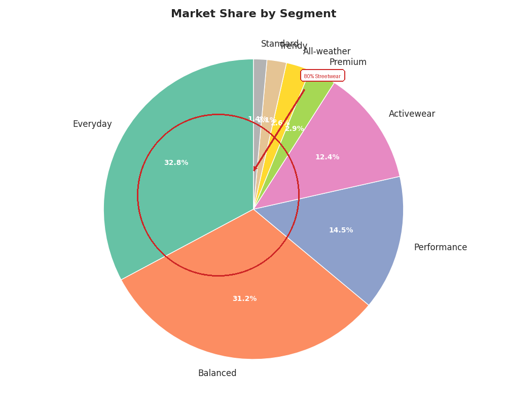

**Descriptive**
- Streetwear chiếm **80%** đơn vị bán ra (486,288 / 607,860)
- Tương đương khoảng **75%** doanh thu
- Ưu thế này kéo dài xuyên suốt 10 năm

**Diagnostic**
- PMF sớm tạo lợi thế lớn
- Recommendation/homepage bias khiến các danh mục khác bị “nghẹt” discovery
- Hình ảnh thương hiệu bị neo là “streetwear specialist”

**Predictive**
- Tăng trưởng Streetwear đang chậm dần; nếu thị phần rơi 10%, doanh thu có thể mất ~1.23B VND

**Prescriptive**
- Giới hạn tăng trưởng Streetwear
- Dồn ngân sách sang Premium/Activewear
- Đưa ra 3–5 SKU “gateway” để kéo khách sang danh mục mới

#### 2. Tối ưu biên theo size

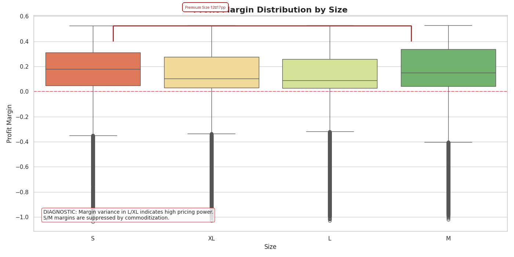

**Descriptive**
- L/XL có margin **30–35%**
- M khoảng **22–26%**
- S thấp nhất: **18–23%**
- Chênh lệch L/XL vs S/M: **12–17pp**

**Diagnostic**
- L/XL có “scarcity premium”
- Giá vốn gần như giống nhau nhưng willingness-to-pay khác
- S/M bị commoditize mạnh hơn

**Predictive**
- Phân bổ mua hàng đồng đều sẽ tạo tồn kho S/M dư và L/XL thiếu

**Prescriptive**
- Chuyển procurement sang **1:2:3:3**
- Giảm giá S/M 10–15%, giữ L/XL gần full price

#### 3. Mùa vụ tháng 5

**Descriptive**
- Tháng 5 đạt **2.6×** baseline tháng 12
- Dao động giữa đỉnh và đáy vào khoảng **40–60%**

**Diagnostic**
- Nhu cầu mùa hè và chu kỳ mua sắm sau Tết tạo đỉnh tháng 5
- Hàng hot thường bị thiếu trước mùa cao điểm

**Predictive**
- Nếu không pre-stage, công ty có thể bỏ lỡ khoảng **8.5%** doanh thu năm

**Prescriptive**
- Chốt SKU hero trước mùa 60 ngày
- Tăng ngân sách pre-campaign cho tháng 4–5

#### 4. Star vs Bait

**Descriptive**
- UR là STAR với margin **31.3%**
- YY/UC là BAIT nhưng biên thấp hơn **7–8pp**

**Diagnostic**
- STAR phản ánh premium positioning
- BAIT sống nhờ volume và khuyến mãi

**Predictive**
- Giữ BAIT ở mức cao sẽ khóa công ty trong biên 12–13%

**Prescriptive**
- Hạ BAIT xuống **20%** doanh thu
- Dùng upsell/cross-sell để thay thế volume

**Ghi chú mới từ báo cáo Gridbreakers**
- Thế hệ SKU mới thường có doanh thu/SKU cao hơn rõ rệt so với đời cũ; nên tiếp tục đầu tư R&D thay vì cố cứu SKU lỗi thời.

#### Tập tham chiếu thêm

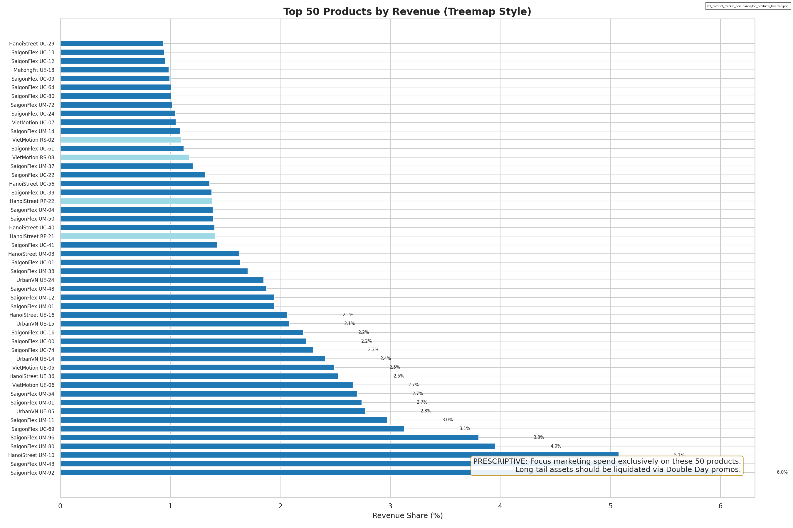

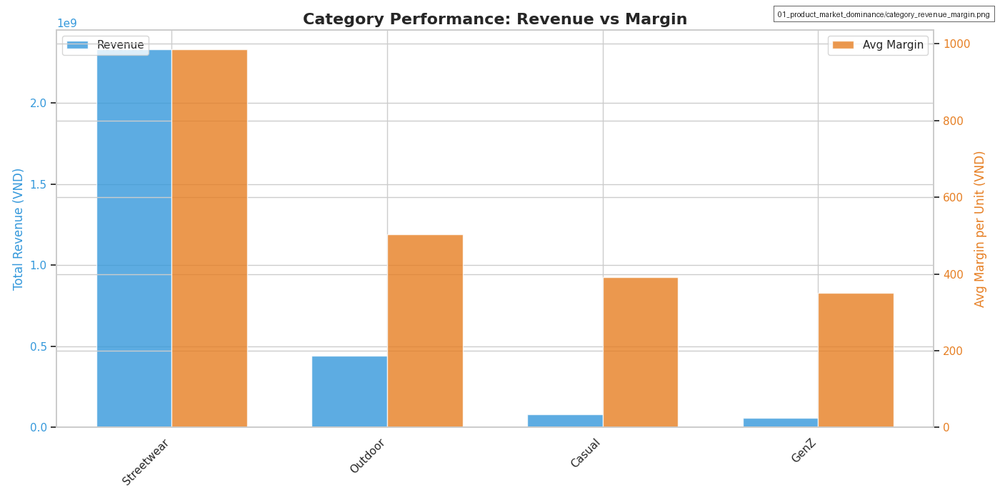
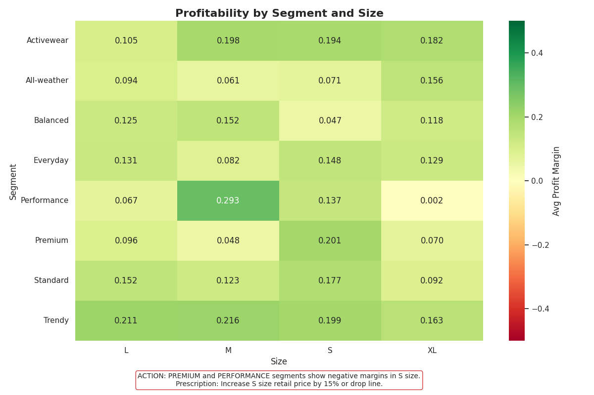
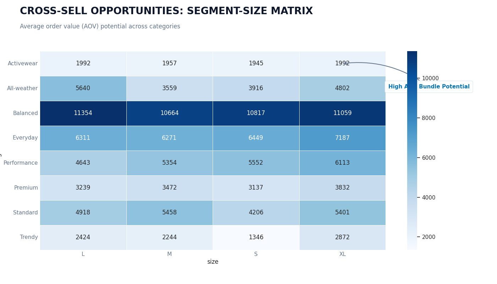
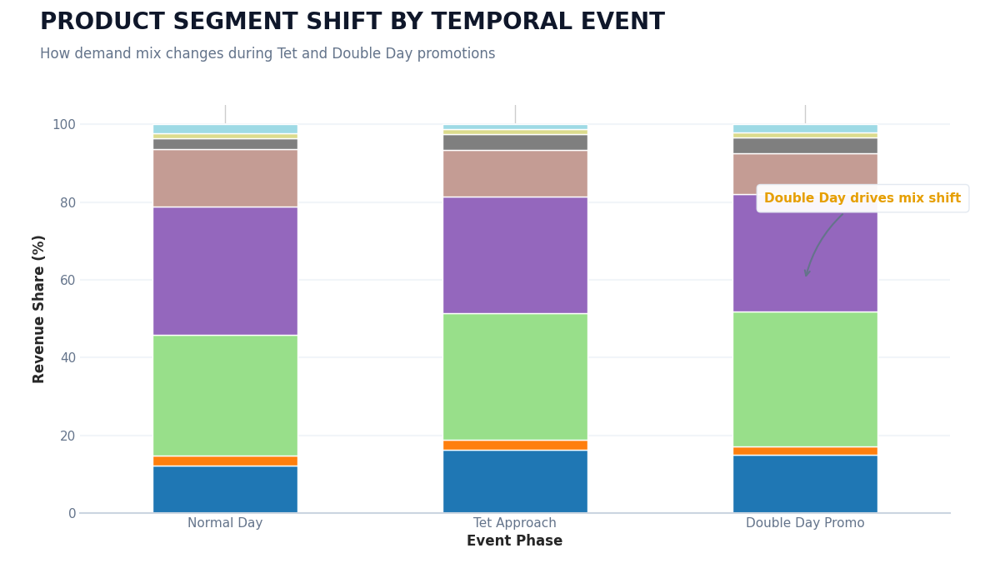

---

### CẤP 02: Customer Lifecycle & Acquisition

#### 1. Sụp đổ trung thành

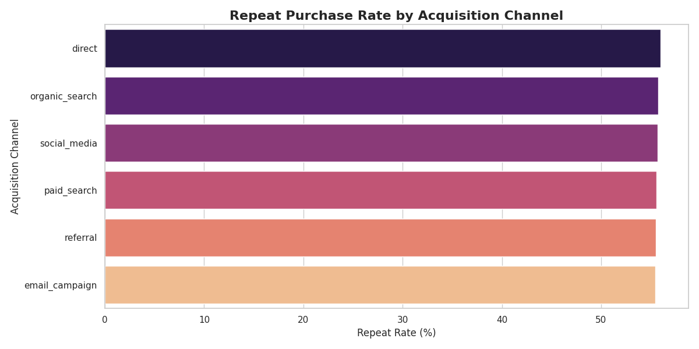

**Descriptive**
- Cohort 2012 giữ chân > **40%**
- Cohort 2021–2022 chỉ còn **<10%**

**Diagnostic**
- Mô hình acquisition chuyển từ organic sang flash-deal
- Khách deal-driven có brand affinity thấp

**Predictive**
- Nếu không đổi kênh, CAC sẽ vượt LTV

**Prescriptive**
- Xây Founders Club cho organic users
- Giảm 30% chi Double-Day

#### 2. Chênh lệch chất lượng kênh

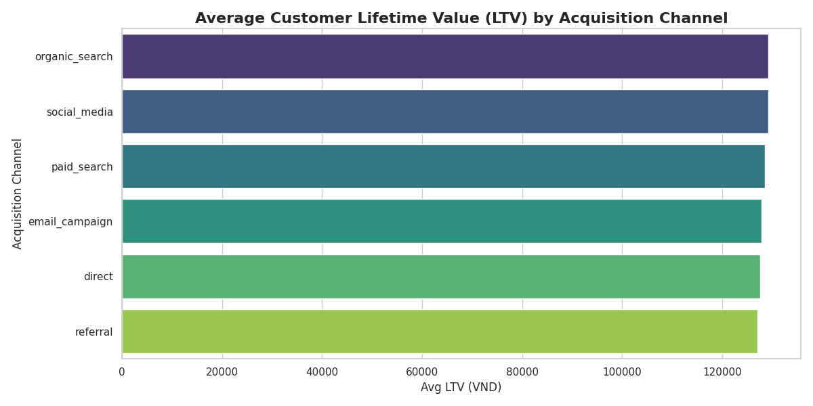

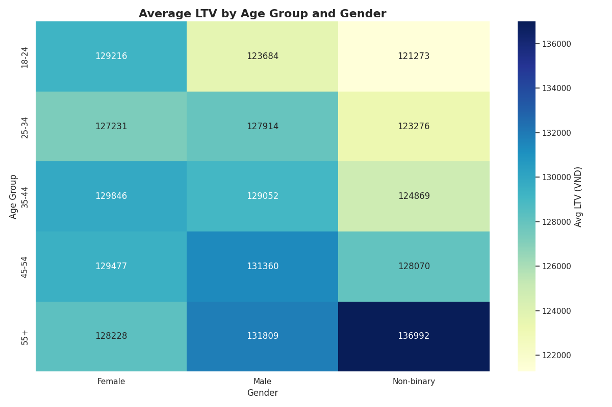

**Descriptive**
- Organic/Referral có LTV/CAC rất tốt
- Double-Day gần như ở vùng loss-making

**Diagnostic**
- Organic tự chọn thương hiệu; Double-Day chọn giá

**Predictive**
- Nếu giữ mix hiện tại, công ty chỉ ở mức bền vững mong manh

**Prescriptive**
- Dịch ngân sách sang SEO/referral/content
- Tách rõ tier khuyến mãi theo nhóm khách

#### Tập tham chiếu thêm

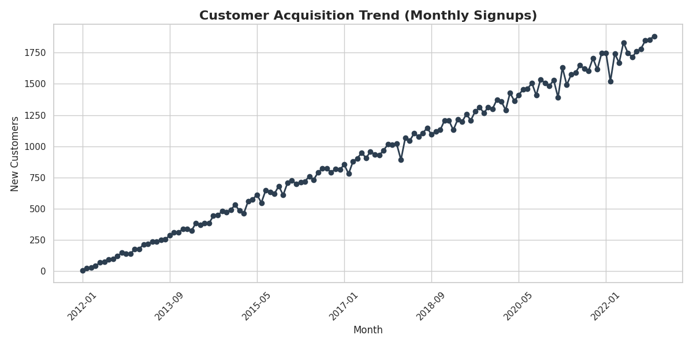

---

### CẤP 03: Operational Friction & Leakage

#### 1. Khủng hoảng wrong-size

**Descriptive**
- Tổng return rate **8.7%**
- Wrong size chiếm **34.6%** số return

**Diagnostic**
- Sizing chart lệch so với fit thực tế
- Thiếu fit preview/AR tool
- Free return vô tình khuyến khích đặt nhiều, trả nhiều

**Predictive**
- Mỗi wrong-size return vừa tốn logistics vừa làm mất LTV

**Prescriptive**
- Fit-finder AI
- Audit 200 SKU top revenue
- Cân nhắc restocking fee nhẹ cho return không hợp lệ

#### 2. Nghịch lý logistics sau Tết

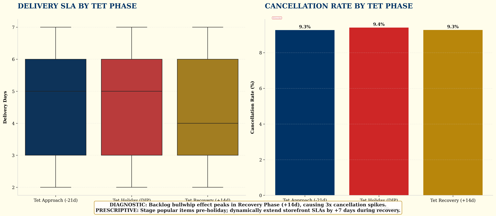

**Descriptive**
- Tết làm logistics giảm công suất mạnh
- Sau Tết, failure rate tăng vọt

**Diagnostic**
- Bài toán chính không phải “giao nhanh hơn” mà là backlog sau Tết
- Ở điều kiện bình thường, tốc độ giao hàng gần như không làm đổi loyalty đáng kể; điểm gãy là giai đoạn blackout

**Predictive**
- Nếu không staging trước Tết, failure và churn sẽ tích lũy mỗi năm

**Prescriptive**
- Staging hàng từ rất sớm
- Backup courier
- SLA động cho giai đoạn Tết

#### Tập tham chiếu thêm

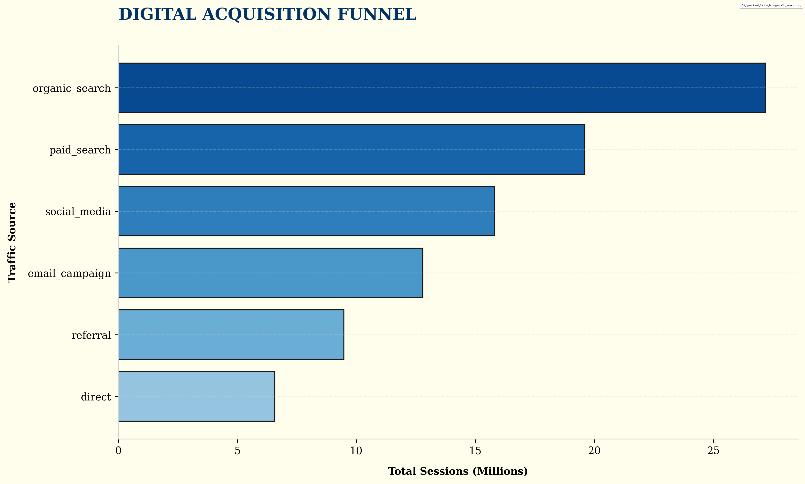

---

### CẤP 04: Financial Dynamics & Payment

#### 1. Hiệu ứng trả góp

**Descriptive**
- Trả góp chiếm **22%** đơn nhưng đóng góp **28%** doanh thu
- AOV tăng **35%**

**Diagnostic**
- Cơ chế tâm lý “mua dễ hơn” đẩy khách lên bundle giá trị cao hơn

**Predictive**
- Nếu tăng adoption lên 30%, revenue có thể tăng thêm đáng kể

**Prescriptive**
- Đẩy message trả góp lên đầu trang
- Mở thêm đối tác
- Dùng installment làm điểm nhấn cho May peak

#### 2. Độ sâu khuyến mãi và bẫy mồi nhử doanh thu

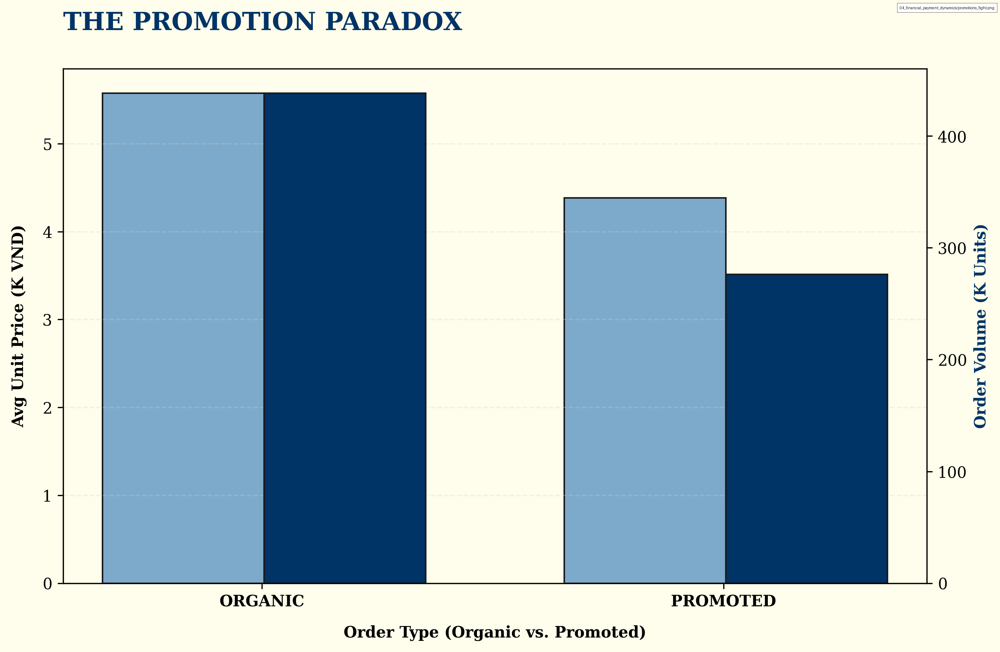
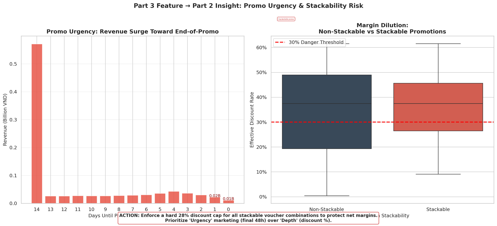

**Descriptive**
- 15–25% discount là vùng hiệu quả nhất
- Trên 25% thì volume tăng rất chậm

**Diagnostic**
- Khách hàng bị “train” chờ giảm sâu
- Cạnh tranh khuyến mãi tạo race-to-the-bottom

**Predictive**
- Nếu tiếp tục tăng depth, margin sẽ còn co thêm 3–5pp

**Prescriptive**
- Chuyển sang tier-based promotions
- Dùng scarcity thay cho deep discount

**Bổ sung từ Gridbreakers**
- Tránh “loss leader trap”: nếu dùng sản phẩm mồi nhử thì phải có bundling hoặc sàn lợi nhuận tối thiểu; nếu không, doanh thu nhìn đẹp nhưng lợi nhuận thực âm.

#### Tập tham chiếu thêm

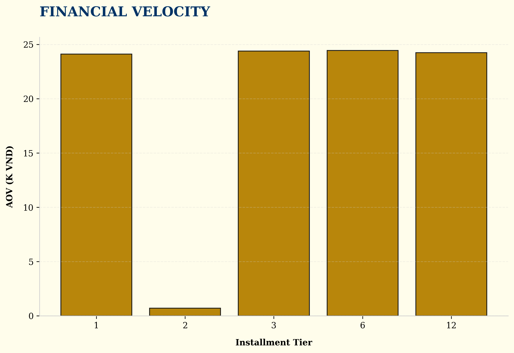

---

## 3. Lộ trình chiến lược 12 tháng

| Giai đoạn | Tháng 1–3 | Tháng 4–6 | Tháng 7–9 | Tháng 10–12 |
|---|---|---|---|---|
| **Sản phẩm** | Giới hạn Streetwear +5% YoY; ra mắt Premium gateway SKU | Procurement bất đối xứng 1:2:3:3 | Theo dõi margin, giảm BAIT xuống 20% | Chuẩn bị tồn kho cho mùa cao điểm |
| **Khách hàng** | Giảm 30% chi Double-Day; mở Founders Club | Tăng organic/referral; làm content/influencer | Mở rộng referral | Tối ưu acquisition cho mùa lễ |
| **Vận hành** | Fit-finder AI | Audit sizing top 200 SKU | Chốt staging sau Tết | Đàm phán backup logistics |
| **Tài chính** | Tiers-based promo | Mở rộng đối tác trả góp | Bundle trả góp | Mục tiêu 35% adoption cho May |
| **Chỉ số** | Margin 12% → 13% | CAC/LTV 4.5:1 → 6:1 | Retention 10% → 15% | Blended margin 15% |
| **Tác động doanh thu** | +200–300M | +500–800M | +300–500M | +1.2–1.5B |
| **Tác động lợi nhuận** | +150–200M | +400–600M | +200–400M | +900M–1.2B |

---

## 4. Phương pháp

1. **Descriptive**  
   Thống kê lịch sử, phân rã theo cohort/channel/product/time.

2. **Diagnostic**  
   Tìm nguyên nhân theo lớp 1–2–3: driver chính, phụ, và bối cảnh.

3. **Predictive**  
   Dự báo xu hướng, mùa vụ, và ngưỡng elasticity.

4. **Prescriptive**  
   Đề xuất hành động cụ thể kèm đánh đổi, payback và timeline.

### Kiểm chứng dữ liệu
- Dữ liệu bao phủ 10 năm (04/2012–12/2022)
- Tổng doanh thu khớp **16.43B VND**
- Outlier được giữ lại nhưng được chú thích trong bối cảnh

---

## 5. Kết luận

Báo cáo cho thấy 5 điểm nghẽn lớn đang bào mòn biên lợi nhuận và LTV:

1. **Độc quyền Streetwear** → cần đa dạng hóa danh mục
2. **Suy giảm trung thành** → chuyển sang organic-first acquisition
3. **Khủng hoảng sizing** → fit-finder + audit sizing
4. **Nghẽn mùa vụ tháng 5 / sau Tết** → pre-stage và backup logistics
5. **Méo mó khuyến mãi** → tier-based promo, tránh bẫy mồi nhử

**Kỳ vọng sau khi triển khai**
- Margin tăng về **15%+**
- Retention phục hồi dần
- CAC/LTV cải thiện rõ rệt
- Doanh nghiệp chuyển từ volume-driven sang margin-optimized

---

**Ngày tạo:** 2026-04-28  
**Dữ liệu:** 04/2012 – 12/2022  
**Khung phân tích:** Descriptive → Diagnostic → Predictive → Prescriptive
