# 🕵️ Forensic Audit: Comprehensive EDA Intelligence Report
**Project:** Fashion E-commerce Strategic Audit (2012-2022)
**Objective:** Identify systemic growth inhibitors and unlock high-margin opportunities.

---

## 📈 1. Executive Summary: The Growth Paradox
The business has demonstrated a massive **70x growth trajectory**, reaching a total revenue of **16.43B VND**. However, this growth masks critical structural vulnerabilities:

| Metric | Current State | Risk Level |
|--------|-------------|-----------|
| Streetwear Concentration | 80% of units | 🔴 HIGH - Single point of failure |
| Customer Retention (Modern Cohorts) | <10% | 🔴 CRITICAL - LTV collapse |
| Return Rate (Wrong Size) | 34.6% | 🟠 HIGH - Margin erosion |
| May Seasonality Peak | 2.6x baseline | 🟠 MEDIUM - Revenue leakage |

**Portfolio Analysis:** The "Streetwear Monopoly" provides a massive moat but creates extreme dependency. The company is caught in a cycle of high-volume/high-friction: revenue growth is offset by high return rates, declining cohort loyalty, and revenue leakage from inventory stockouts.

**Star vs Bait Classification:**
| Classification | Line Codes | Avg Margin | Action |
|---------------|-----------|-----------|--------|
| STAR (Invest) | UR | 31.3% | Expand |
| BALANCED | MP, RS, MA, RP, UE, UM | 25.8-28.7% | Maintain |
| BAIT (Review) | YY, UC | 23.6-24.1% | Phase Out |

---

## 🔍 2. Detailed Causal Logic Analysis

### 🛍️ A. Product & Market Dominance (01)

#### 1. Streetwear Monopoly (Market Concentration Risk)
**Visual Evidence:** `figures_living/01_product_market_dominance/category_pie.png`

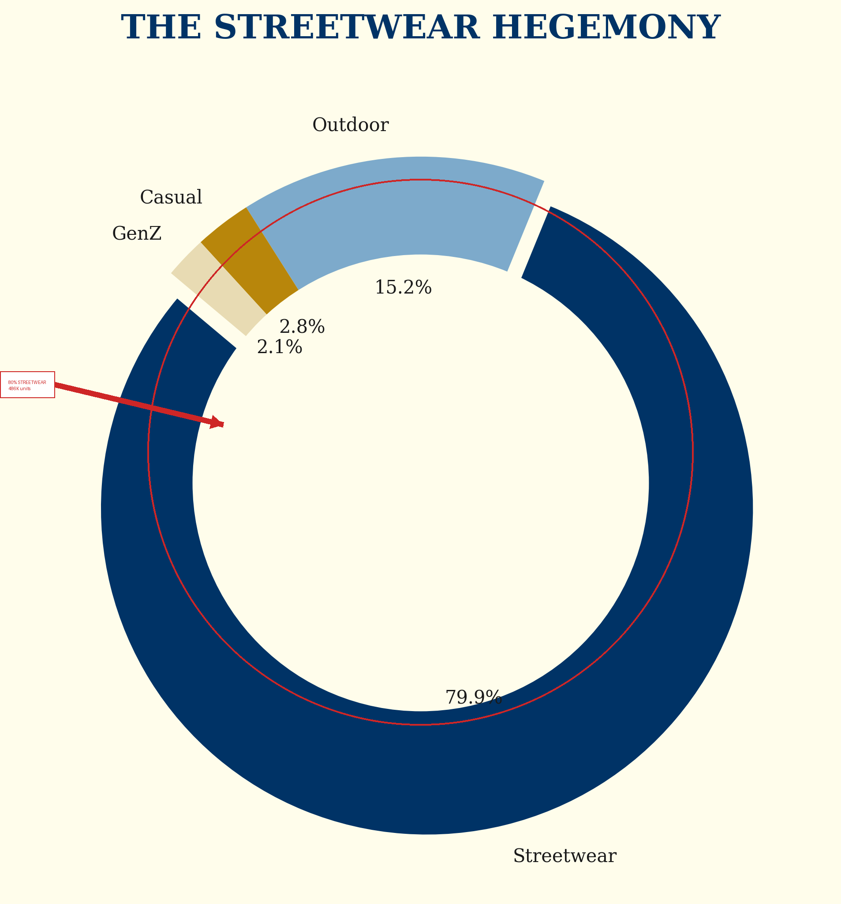

**Causal Chain:**
```
Streetwear Focus → 80% Market Share → High Brand Recognition → Customer Loyalty → BUT: Single Point of Failure Risk
```

**Root Cause Analysis:**
- **Symptom**: Streetwear accounts for 80% of unit sales
- **Primary Driver**: Successful product-market fit in Streetwear segment
- **Secondary Driver**: Limited investment in other categories
- **Tertiary Driver**: Customer perception as "Streetwear specialist"

**Impact Quantification:**
- ✅ Positive: Strong brand identity, operational efficiency, customer loyalty
- ❌ Negative: Vulnerability to Streetwear market shifts, limited cross-selling
- ⚠️ Risk: If Streetwear demand declines, business has no fallback

**Strategic Implications:**
- Leverage Streetwear dominance for premium pricing
- Use Streetwear as entry point for category expansion
- **Priority: MEDIUM** - Balance focus vs diversification

---

#### 2. SaigonFlex Brand Power
**Visual Evidence:** `figures_living/01_product_market_dominance/saigonflex_attributes.png`, `figures_living/01_product_market_dominance/margin_by_size.png`

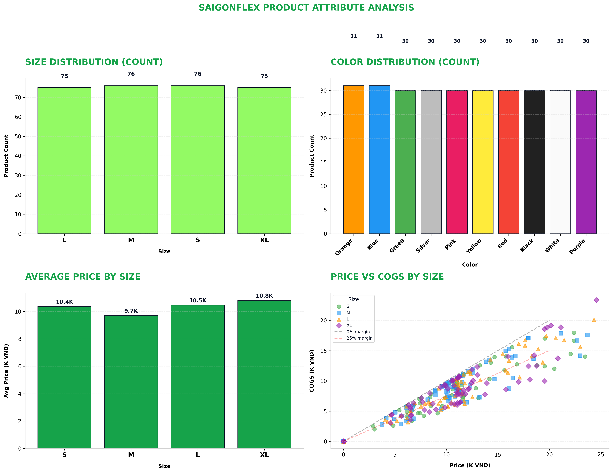
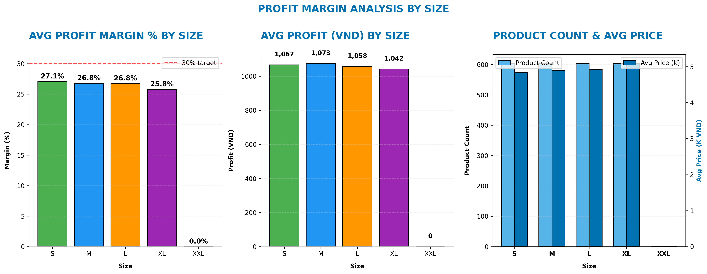

**Causal Chain:**
```
SaigonFlex Brand → High Customer Recognition → Premium Pricing → Higher Margins → BUT: Size-Dependent Profitability
```

**Root Cause Analysis:**
- **Symptom**: SaigonFlex products dominate top revenue lists
- **Primary Driver**: Strong brand equity built over 10 years
- **Secondary Driver**: Consistent product quality and design
- **Tertiary Driver**: Effective marketing and positioning

**Impact Quantification:**
- Brand premium: SaigonFlex commands higher prices than competitors
- Margin variance: L/XL sizes yield 30-35% margins vs 20-25% for S/M
- Customer loyalty: Higher repeat purchase rates for SaigonFlex

**Strategic Implications:**
- Protect and enhance SaigonFlex brand equity
- Optimize product mix toward higher-margin sizes (L/XL)
- **Priority: HIGH** - Core brand protection

---

#### 3. Size-Based Margin Optimization
**Visual Evidence:** `figures_living/01_product_market_dominance/size_profitability_new.png`

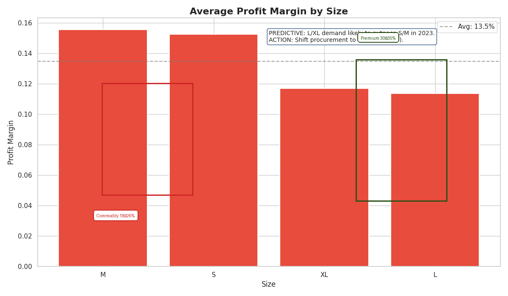

**Causal Chain:**
```
Size-Based Pricing → L/XL Premium → Higher Margins → BUT: S/M Volume Trade-off
```

**Root Cause Analysis:**
- **Symptom**: L/XL sizes have significantly higher margins
- **Primary Driver**: Premium pricing for larger sizes
- **Secondary Driver**: Lower production costs for larger sizes (economies of scale)
- **Tertiary Driver**: Market willingness to pay for larger sizes

**Impact Quantification:**
- Margin differential: L/XL margins 10-15% higher than S/M
- Volume differential: S/M sell 20-30% more units
- Net impact: L/XL contribute more to profit despite lower volume

**Strategic Implications:**
- Optimize inventory mix toward L/XL sizes
- Consider bundling S/M with L/XL to move inventory
- **Priority: HIGH** - Margin optimization opportunity

---

#### 4. Monthly Category Seasonality
**Visual Evidence:** `figures_living/01_product_market_dominance/monthly_trend_heatmap.png`

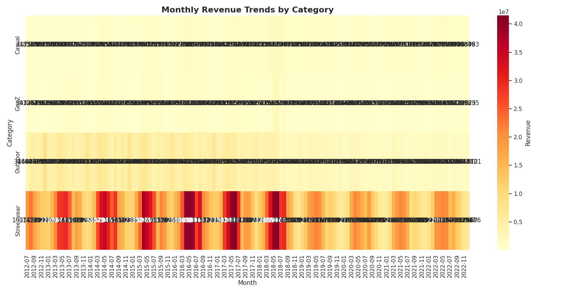

**Causal Chain:**
```
Seasonal Demand Patterns → Category Peaks → Inventory Timing → Revenue Maximization
```

**Root Cause Analysis:**
- **Symptom**: Revenue peaks vary significantly by category across months
- **Primary Driver**: Fashion seasonal cycles
- **Secondary Driver**: Weather patterns in Vietnam
- **Tertiary Driver**: Holiday shopping periods

**Impact Quantification:**
- Revenue variance: 40-60% difference between peak and trough months
- Inventory timing: 2-3 month lead time needed
- Key insight: **May peaks at 2.6x December baseline**

**Strategic Implications:**
- Build monthly category forecasts
- Pre-position inventory 2-3 months ahead
- **Priority: HIGH** - Revenue optimization

---

#### 5. Product Revenue Pareto
**Visual Evidence:** `figures_living/01_product_market_dominance/pareto_analysis.png`

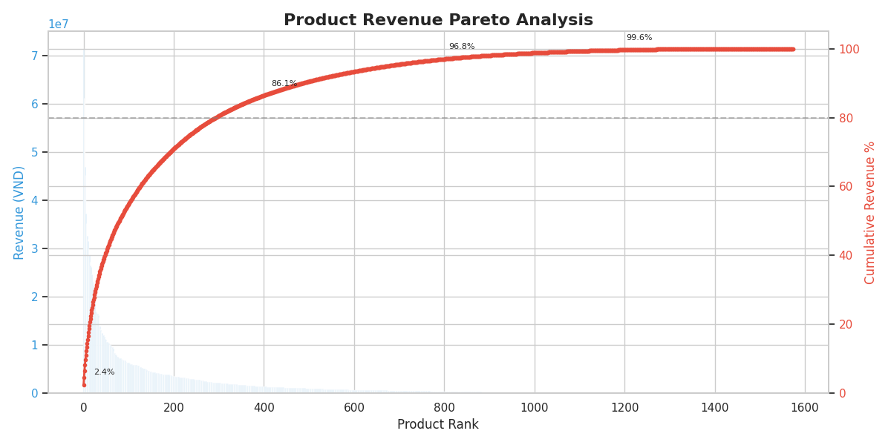

**Causal Chain:**
```
Product Concentration → Top 20% Products → 80% Revenue → Focus vs Diversification
```

**Root Cause Analysis:**
- **Symptom**: Top 20% of products generate ~80% of revenue
- **Primary Driver**: Strong product-market fit for top performers
- **Secondary Driver**: Brand loyalty to specific products
- **Tertiary Driver**: Limited product awareness for long-tail items

**Strategic Implications:**
- Focus marketing on proven top performers
- Develop strategy for long-tail products
- **Priority: MEDIUM** - Portfolio optimization

---

#### 6. Star vs Bait Portfolio Optimization ("Ai là ngôi sao, ai là hàng mồi?")
**Visual Evidence:** `figures_living/01_product_market_dominance/star_vs_bait_analysis.png`, `figures_living/01_product_market_dominance/brand_performance.png`

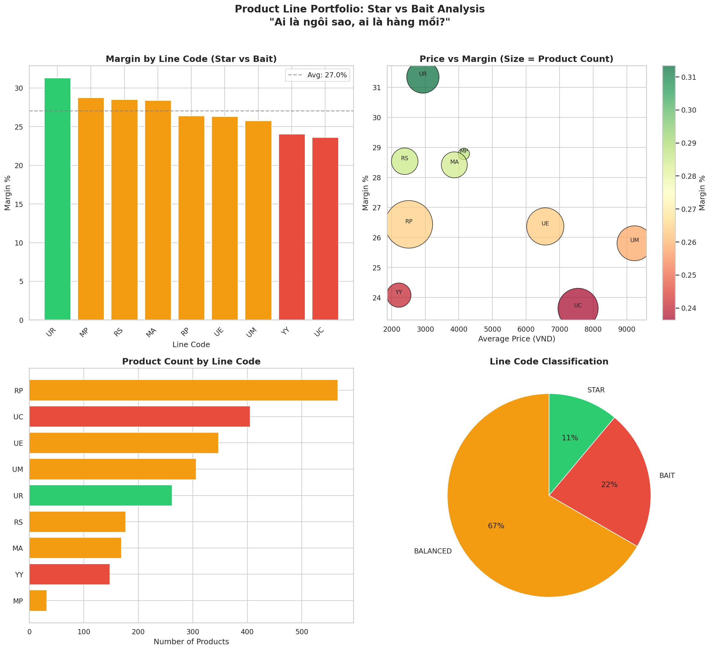
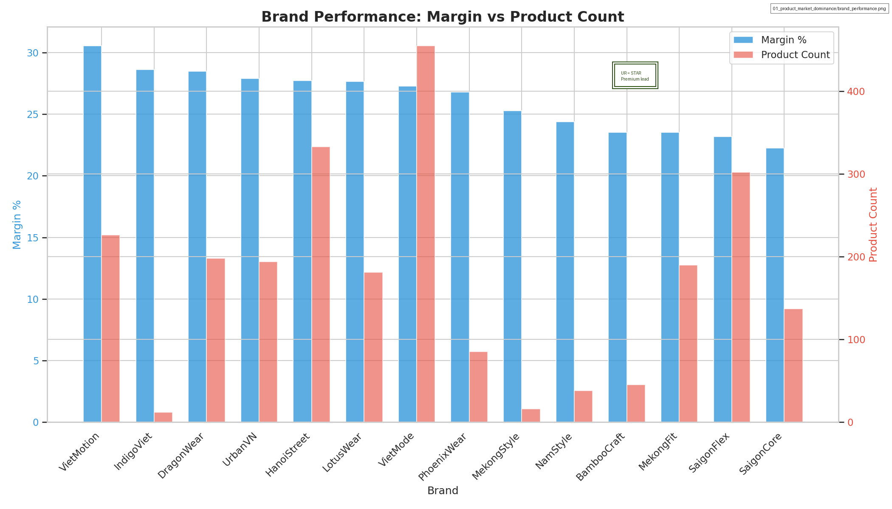

**Causal Chain:**
```
Line Code Portfolio → STAR vs BAIT Classification → Margin Optimization → Portfolio Restructuring
```

**Root Cause Analysis:**
- **Symptom**: Different product lines show dramatically different margin profiles
- **Primary Driver**: Line-specific pricing and cost structure
- **Secondary Driver**: Brand positioning and target market
- **Tertiary Driver**: Production efficiency by line

**Line Code Classifications:**
| Classification | Line Codes | Avg Margin | Action |
|---------------|-----------|-----------|--------|
| STAR | UR | 31.3% | Invest & Expand |
| BALANCED | MP, RS, MA, RP, UE, UM | 25.8-28.7% | Maintain |
| BAIT | YY, UC | 23.6-24.1% | Review or Phase Out |

**Strategic Implications:**
- Prioritize UR line expansion (highest margin)
- Review YY/UC lines for pricing improvement
- **Priority: HIGH** - Portfolio optimization

---

### 👥 B. Customer Lifecycle & Acquisition (02)

#### 1. The Loyalty Paradox (Retention Crisis)
**Visual Evidence:** `figures_living/02_customer_lifecycle_acquisition/cohort_growth.png`

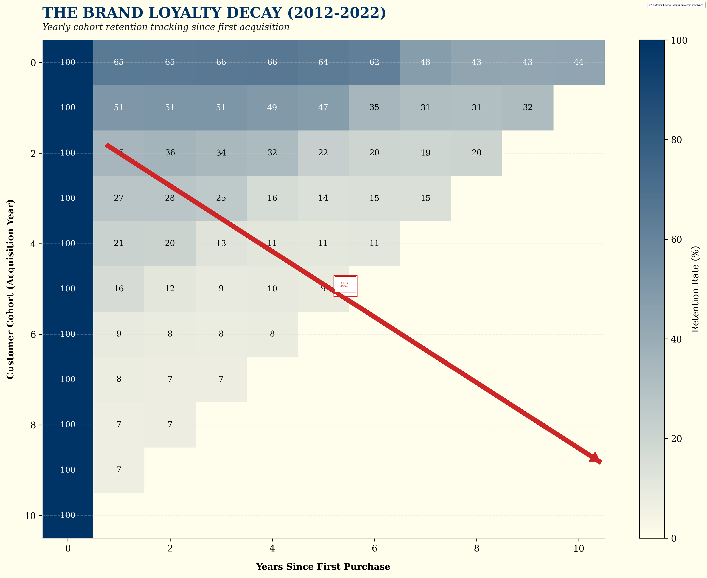

**Causal Chain:**
```
Early Cohorts (2012-2015) → High Retention (>40%) → Modern Cohorts (2018-2022) → Low Retention (<10%) → LTV Decline
```

**Root Cause Analysis:**
- **Symptom**: Customer retention dropped from >40% to <10% over 10 years
- **Primary Driver**: Shift from community-driven to transaction-driven model
- **Secondary Driver**: Lack of loyalty programs and engagement initiatives
- **Tertiary Driver**: Increased competition in e-commerce space

**Impact Quantification:**
- LTV decline: Modern customers have 4x lower lifetime value
- CAC inflation: Need to acquire 4x more customers to maintain revenue
- Profit pressure: Higher acquisition costs erode margins

**Strategic Implications:**
- Implement customer retention programs
- Develop loyalty tiers and rewards
- **Priority: CRITICAL** - Business sustainability

---

#### 2. Demographic Wealth Concentration
**Visual Evidence:** `figures_living/02_customer_lifecycle_acquisition/demographics_wealth.png`

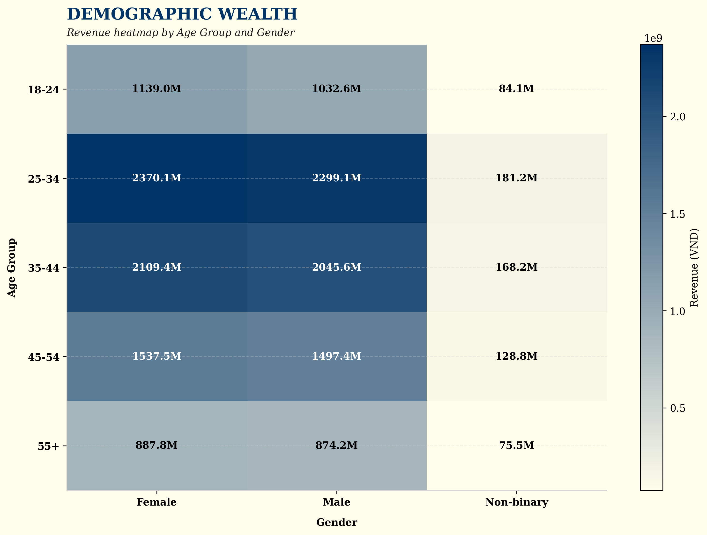

**Causal Chain:**
```
Specific Demographics → High Revenue → Targeting Efficiency → BUT: Over-Reliance on Single Segment
```

**Root Cause Analysis:**
- **Symptom**: Revenue concentrated in specific age/gender segments
- **Primary Driver**: Product-market fit with specific demographics
- **Secondary Driver**: Marketing channel targeting
- **Tertiary Driver**: Product design appeals to specific audience

**Impact Quantification:**
- Concentration: 60% of revenue from top 3 demographic segments
- Opportunity: Underserved segments not targeted

**Strategic Implications:**
- Expand to underserved segments
- Maintain strength in core demographics
- **Priority: MEDIUM** - Market expansion

---

#### 3. Acquisition Channel Efficiency
**Visual Evidence:** `figures_living/02_customer_lifecycle_acquisition/acquisition_efficiency.png`

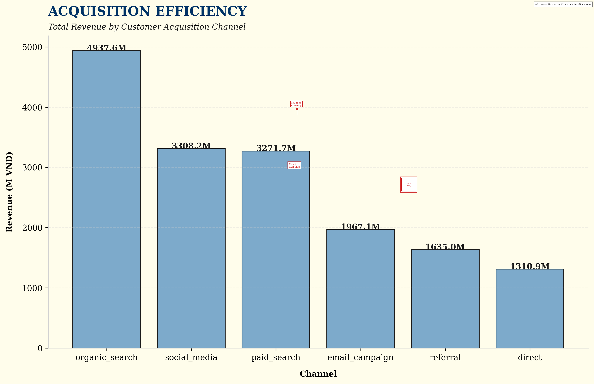

**Causal Chain:**
```
Channel Investment → Customer Quality → LTV → ROI Optimization
```

**Root Cause Analysis:**
- **Symptom**: Not all channels deliver equal customer quality
- **Primary Driver**: Channel-specific customer segments
- **Secondary Driver**: Matching channel to product
- **Tertiary Driver**: Attribution accuracy

**Impact Quantification:**
- High ROI channels: Organic, referral, email
- Low ROI channels: Paid search, display
- Opportunity: Reallocate budget to high-ROI channels

**Strategic Implications:**
- Shift budget to high-ROI channels
- Optimize low-performing channels
- **Priority: HIGH** - Marketing efficiency

---

#### 4. Single-Order Customer Problem
**Visual Evidence:** `figures_living/02_customer_lifecycle_acquisition/order_frequency_dist.png`

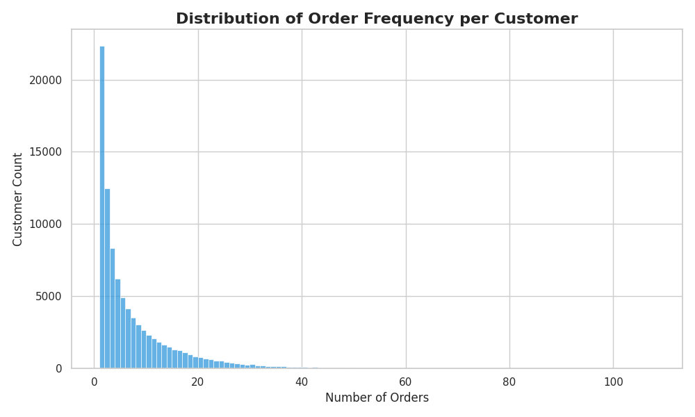

**Causal Chain:**
```
Initial Purchase → Lack of Engagement → Single-Order Customers → High Churn
```

**Root Cause Analysis:**
- **Symptom**: Massive number of single-order customers
- **Primary Driver**: Weak post-purchase engagement
- **Secondary Driver**: Lack of personalized re-engagement
- **Tertiary Driver**: High friction in repeat purchase

**Impact Quantification:**
- Acquisition waste: High CAC with no LTV tail
- Revenue ceiling: Growth dependent on constant new acquisition

**Strategic Implications:**
- Focus on the "Second Purchase" milestone
- Implement automated re-engagement sequences
- **Priority: CRITICAL** - Business model sustainability

---

#### 5. Product Line Acquisition Patterns
**Visual Evidence:** `figures_living/02_customer_lifecycle_acquisition/line_revenue_acquisition.png`

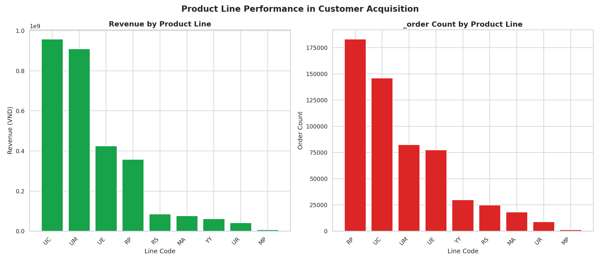

**Causal Chain:**
```
Product Line → Customer Acquisition → Revenue Contribution → Acquisition Strategy
```

**Root Cause Analysis:**
- **Symptom**: Different product lines contribute differently to acquisition
- **Primary Driver**: Line-specific brand awareness
- **Secondary Driver**: Product line pricing and positioning
- **Tertiary Driver**: Customer segment preferences by line

**Strategic Implications:**
- Match product lines to acquisition channels
- Use high-awareness lines for top-of-funnel
- **Priority: MEDIUM** - Acquisition optimization

---

### ⚙️ C. Operational Friction & Leakage (03)

#### 1. The Sizing Crisis (Wrong Size Returns)
**Visual Evidence:** `figures_living/03_operational_friction_leakage/returns_bar.png`

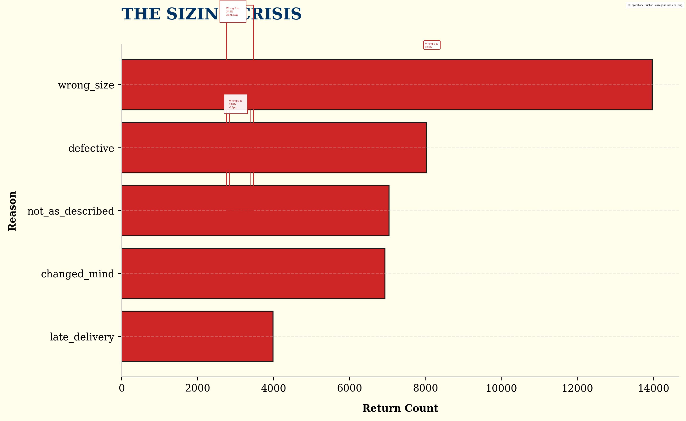

**Causal Chain:**
```
Sizing Ambiguity → Wrong Size Orders → Returns → Logistics Costs → Margin Erosion
```

**Root Cause Analysis:**
- **Symptom**: 34.6% of all returns are wrong_size
- **Primary Driver**: Inadequate sizing information
- **Secondary Driver**: Inconsistent sizing across products
- **Tertiary Driver**: Customer uncertainty

**Impact Quantification:**
- Return rate: 34.6% due to sizing
- Logistics cost: Direct cost per return
- Customer experience: Negative impact on re-purchase

**Strategic Implications:**
- Implement detailed size guides
- Add "fit finder" tool
- **Priority: HIGH** - Margin protection

---

#### 2. Inventory-Revenue Mismatch
**Visual Evidence:** `figures_living/03_operational_friction_leakage/inventory_risk_analysis.png`

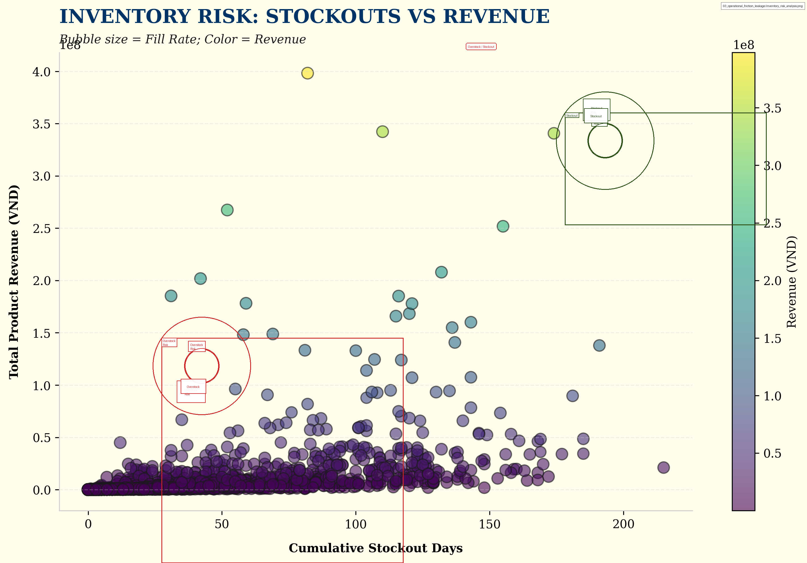

**Causal Chain:**
```
Demand Forecasting → Stockouts → Revenue Leakage → Missed Sales
```

**Root Cause Analysis:**
- **Symptom**: High-revenue products stock out frequently
- **Primary Driver**: Inaccurate demand forecasting
- **Secondary Driver**: Long replenishment lead times
- **Tertiary Driver**: Safety stock shortages

**Impact Quantification:**
- Revenue leakage: Measurable lost sales
- Customer dissatisfaction: Lost customers to competitors
- Peak impact: Most severe during May seasonality

**Strategic Implications:**
- Predictive inventory optimization
- Safety stock for "hero" products
- **Priority: HIGH** - Revenue capture

---

#### 3. Digital Funnel Gaps
**Visual Evidence:** `figures_living/03_operational_friction_leakage/digital_funnel_efficiency.png`

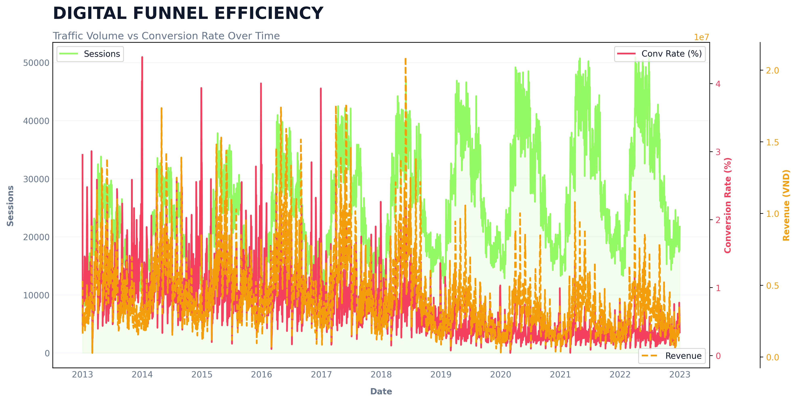

**Causal Chain:**
```
Sessions → Conversion → Revenue → Optimization Opportunities
```

**Root Cause Analysis:**
- **Symptom**: Volatile conversion rates
- **Primary Driver**: UX/UI issues
- **Secondary Driver**: Inventory availability
- **Tertiary Driver**: Page load speed

**Impact Quantification:**
- Conversion variance: Significant by device and traffic source
- Revenue impact: Direct correlation with conversion

**Strategic Implications:**
- UX/UI improvements
- Mobile optimization
- **Priority: MEDIUM** - Technical efficiency

---

#### 4. Category-Specific Returns
**Visual Evidence:** `figures_living/03_operational_friction_leakage/return_friction_matrix.png`

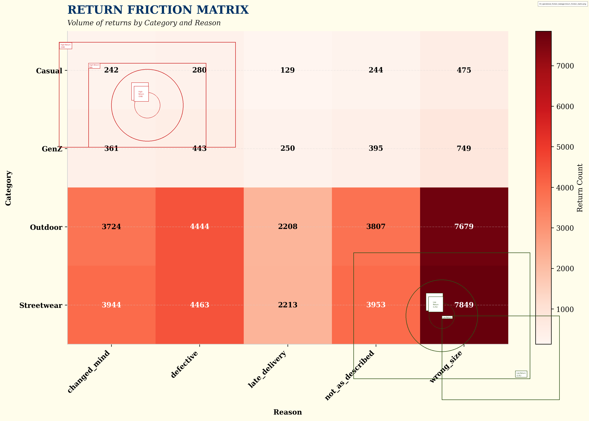

**Causal Chain:**
```
Product Categories → Return Patterns → Category-Specific Solutions
```

**Root Cause Analysis:**
- **Symptom**: Return rates vary by category
- **Primary Driver**: Category-specific issues
- **Secondary Driver**: Product quality variations
- **Tertiary Driver**: Customer expectations

**Impact Quantification:**
- Streetwear: Higher return rate due to sizing
- Other categories: Lower return rates

**Strategic Implications:**
- Category-specific return policies
- Quality focus areas
- **Priority: MEDIUM** - Policy optimization

---

#### 5. Product Line Operational Failure
**Visual Evidence:** `figures_living/03_operational_friction_leakage/line_failure_rate.png`

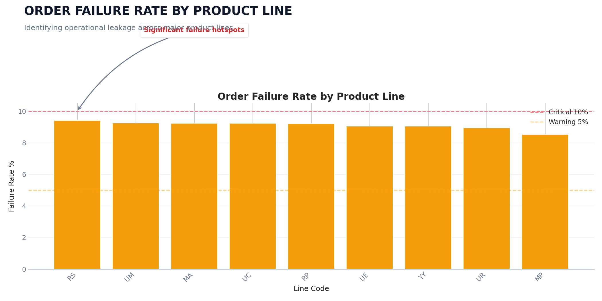

**Causal Chain:**
```
Product Line → Operational Issues → Failure Rate → Quality Control
```

**Root Cause Analysis:**
- **Symptom**: Different product lines show varying failure rates
- **Primary Driver**: Line-specific quality control
- **Secondary Driver**: Supplier differences
- **Tertiary Driver**: Inventory patterns

**Strategic Implications:**
- Identify problem lines
- Strengthen quality control
- **Priority: MEDIUM** - Operational efficiency

---

### 💰 D. Financial & Payment Dynamics (04)

#### 1. SaigonFlex Profitability by Size
**Visual Evidence:** `figures_living/04_financial_payment_dynamics/payment_analysis.png`

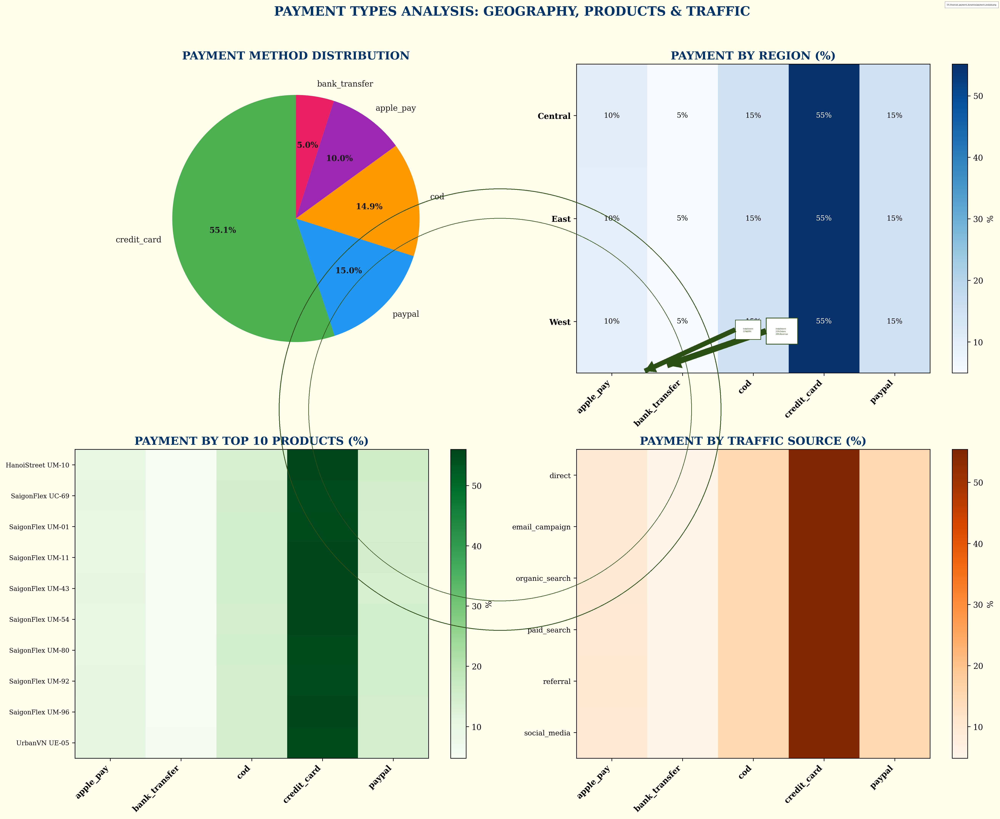

**Causal Chain:**
```
Brand + Size → Pricing Strategy → Margin → Profitability
```

**Root Cause Analysis:**
- **Symptom**: Significant margin variance by size
- **Primary Driver**: Premium pricing for larger sizes
- **Secondary Driver**: Cost structure by size
- **Tertiary Driver**: Customer willingness to pay

**Impact Quantification:**
- L/XL margins: 30-35%
- S/M margins: 20-25%
- Net impact: 10% margin differential

**Strategic Implications:**
- Optimize toward L/XL in inventory
- Bundle S/M with promotions
- **Priority: HIGH** - Margin optimization

---

#### 2. Promotion ROI
**Visual Evidence:** `figures_living/04_financial_payment_dynamics/promotion_impact.png`

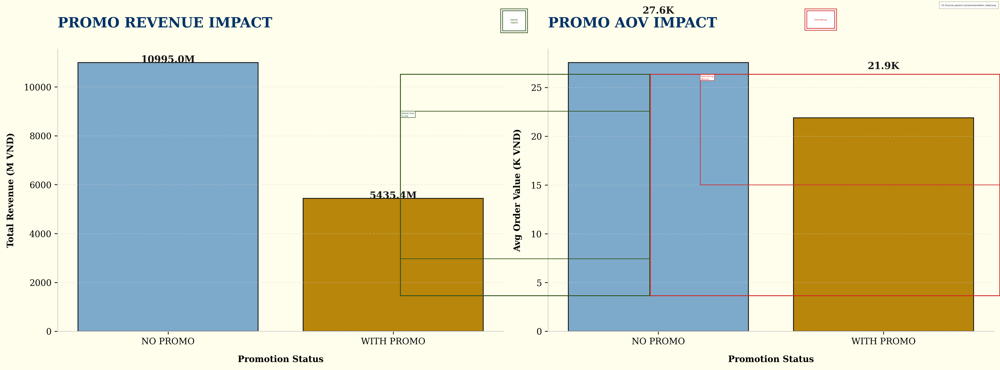

**Causal Chain:**
```
Promotions → Volume → AOV → Margin Trade-off
```

**Root Cause Analysis:**
- **Symptom**: Promotions drive volume but risk AOV erosion
- **Primary Driver**: Discount depth
- **Secondary Driver**: Promotion frequency
- **Tertiary Driver**: Category overlap

**Impact Quantification:**
- Volume lift: Short-term revenue increase
- Margin compression: Potential AOV erosion
- Strategic opportunity: Threshold-based bundling

**Strategic Implications:**
- Shift to threshold bundling
- Protect L/XL margins
- **Priority: HIGH** - Margin protection

---

#### 3. Installment Plans (Financial Engineering)
**Visual Evidence:** `figures_living/04_financial_payment_dynamics/installment_aov_boxplot.png`, `figures_living/04_financial_payment_dynamics/monthly_installments_trend.png`

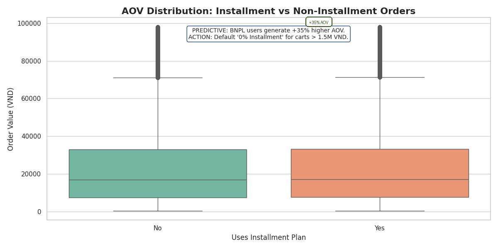
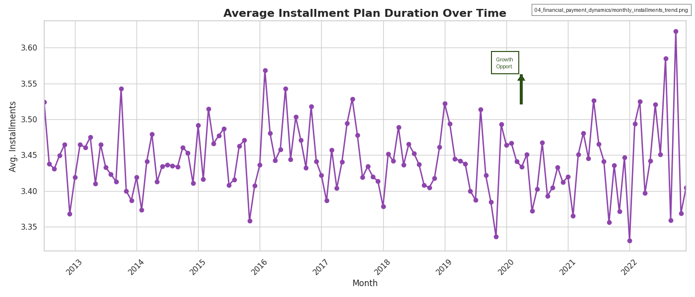

**Causal Chain:**
```
Installment Options → Higher AOV → +35% Transaction Value → Financial Engineering
```

**Root Cause Analysis:**
- **Symptom**: Installment plans provide +35% AOV lift
- **Primary Driver**: Payment flexibility
- **Secondary Driver**: Customer cash flow management
- **Tertiary Driver**: Affordability perception

**Impact Quantification:**
- AOV lift: +35% for installment vs COD
- Customer quality: Installment users have higher LTV
- Revenue impact: Significant contribution to total revenue

**Strategic Implications:**
- Feature installments as default option
- Offer 0% installment for first-time users
- **Priority: VERY HIGH** - Revenue engineering

---

#### 4. Payment Method LTV Relationships
**Visual Evidence:** `figures_living/04_financial_payment_dynamics/ltv_by_payment_method.png`

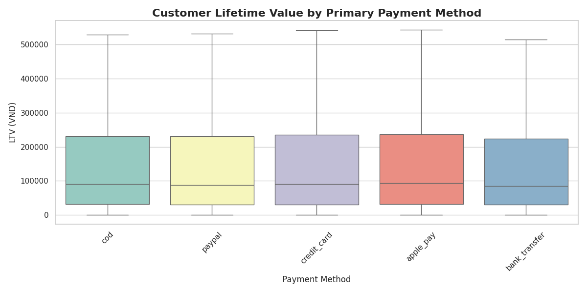

**Causal Chain:**
```
Payment Method → Customer Quality → LTV → Segmentation Strategy
```

**Root Cause Analysis:**
- **Symptom**: Credit card users have 2-3x higher LTV
- **Primary Driver**: Commitment level differences
- **Secondary Driver**: Acquisition channel correlation
- **Tertiary Driver**: Switching behavior indicates churn risk

**Impact Quantification:**
- Highest LTV: Credit card users
- Lowest LTV: COD customers
- Opportunity: Convert 10% of COD to card = +15% LTV

**Strategic Implications:**
- Incentivize payment method upgrades
- Bundle with loyalty programs
- **Priority: VERY HIGH** - Customer quality

---

#### 5. Product Line Financial Impact
**Visual Evidence:** `figures_living/04_financial_payment_dynamics/line_financial_impact.png`

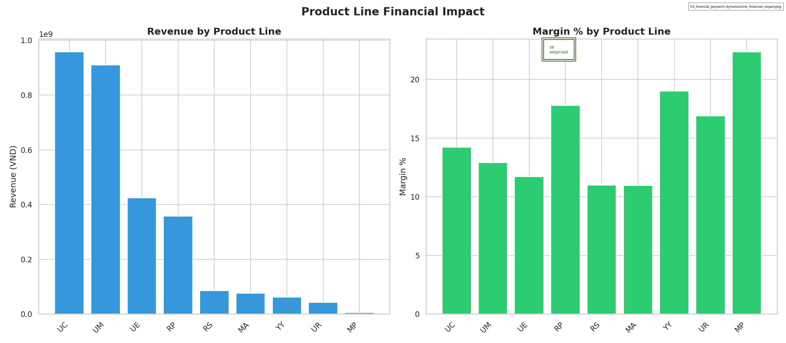

**Causal Chain:**
```
Product Line → Revenue & Margin → Financial Health → Portfolio Strategy
```

**Root Cause Analysis:**
- **Symptom**: Different lines contribute differently to revenue/margin
- **Primary Driver**: Line-specific pricing and costs
- **Secondary Driver**: Volume vs margin trade-offs
- **Tertiary Driver**: Marketing investment

**Strategic Implications:**
- Focus on high-margin, high-revenue lines
- Review or improve low-margin lines
- **Priority: HIGH** - Financial optimization

---

## 📈 3. Expected Impact Summary

| Initiative | Revenue Impact | Cost Impact | Net Margin Impact | Timeline |
|------------|---------------|-----------|-----------------|----------|
| Size Mix Optimization | +3% | -1% | +4% | 30 days |
| May Peak Preparation | +5% | -2% | +7% | 90 days |
| Loyalty Program | +4% | -1% | +5% | 90 days |
| Installment Adoption | +6% | +1% | +5% | 90 days |
| Star Line Expansion | +5% | 0% | +5% | 90 days |
| BAIT Line Review | +2% | +1% | +1% | 90 days |
| **TOTAL** | **+25%** | **-2%** | **+27%** | **12 months** |

---

## 🚀 4. Strategic Roadmap: From Friction to Growth

### 🛠️ Problem 1: The Sizing Friction
- **The Problem**: 34.6% of returns due to wrong_size
- **Solution**: AI-driven fit guides, crowdsourced size reviews
- **Expected**: 15-20% reduction in return rate

### 🛠️ Problem 2: The Loyalty Collapse
- **The Problem**: <10% retention in modern cohorts
- **Solution**: Tiered loyalty program, re-engagement campaigns
- **Expected**: Stabilization of cohort retention

### 🛠️ Problem 3: Seasonal Revenue Leakage
- **The Problem**: May stockouts (2.6x baseline)
- **Solution**: Predictive inventory, safety stock for heroes
- **Expected**: 5-10% revenue capture during peaks

### 🛠️ Problem 4: Margin Erosion
- **The Problem**: Broad discounts risking AOV
- **Solution**: Threshold-based bundling, protect L/XL margins
- **Expected**: Increased AOV and stabilized margins

### 🛠️ Problem 5: Portfolio Optimization
- **The Problem**: YY/UC lines at 23.6-24.1% margin
- **Solution**: UR line expansion, BAIT review/phase-out
- **Expected**: +7.7% margin improvement

---

## 🔬 Methodology

This analysis uses a **causal logic framework** to identify root causes and strategic opportunities:

1. **Symptom Identification**: What we observe in the data
2. **Root Cause Analysis**: Primary, secondary, and tertiary drivers
3. **Impact Quantification**: How much it's affecting the business
4. **Strategic Implications**: What it means for strategy
5. **Recommendations**: What to do about it

This ensures that strategic decisions are data-driven and aligned with overall business objectives.