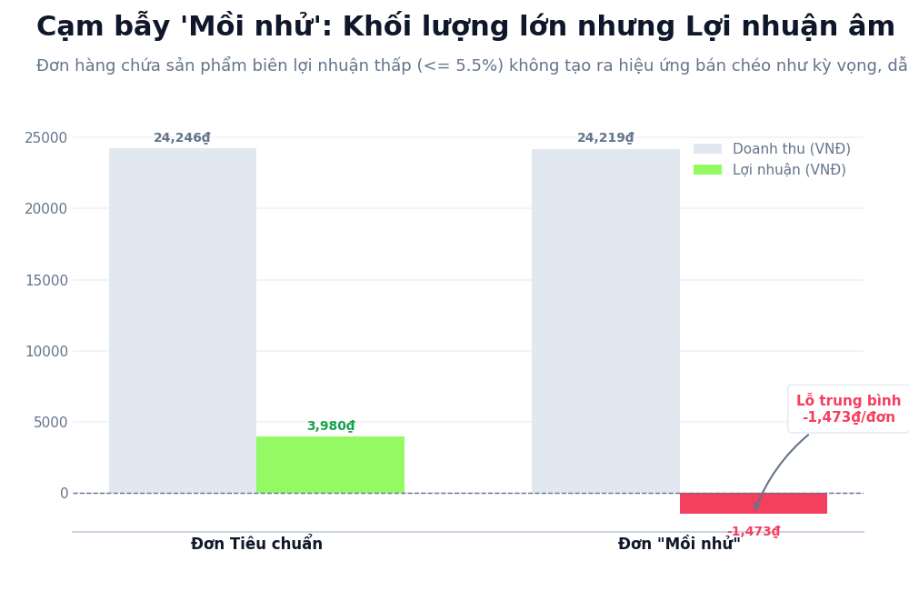
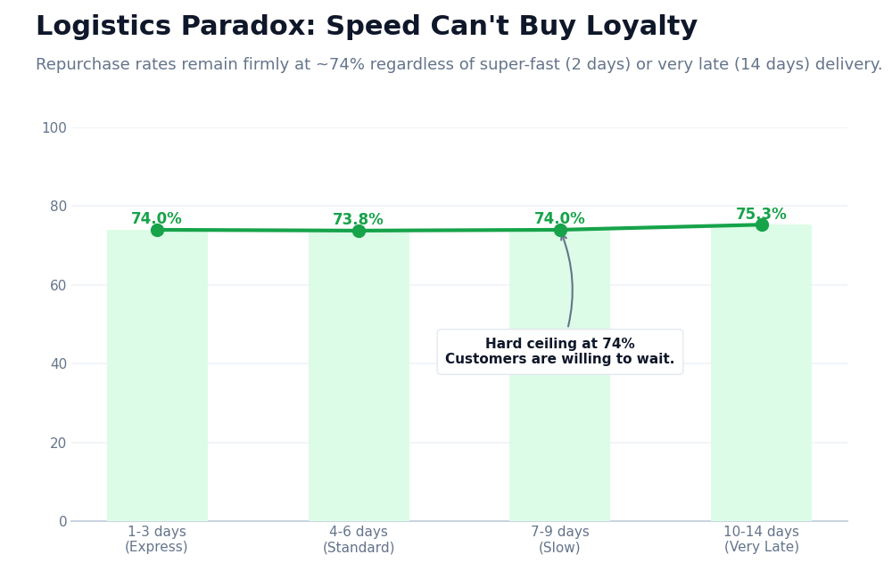
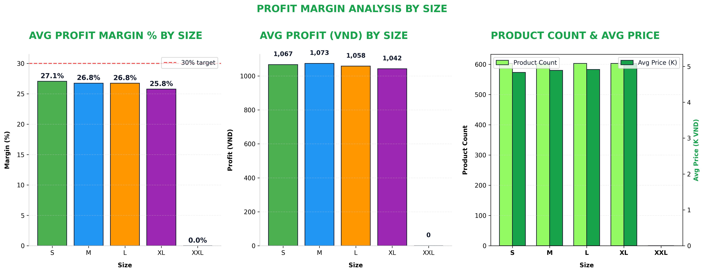
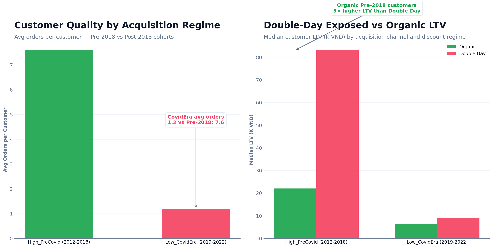
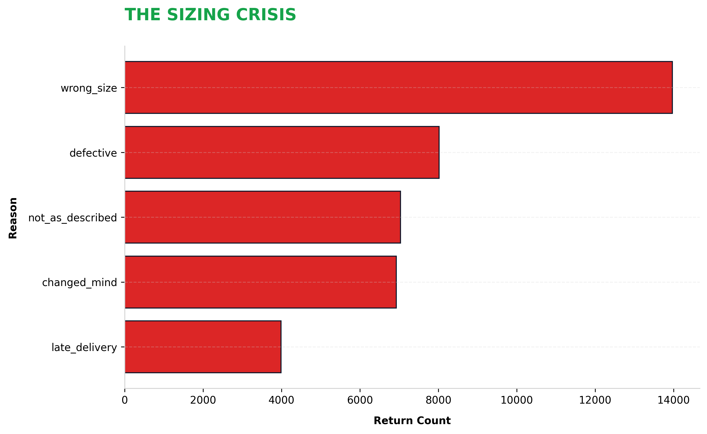
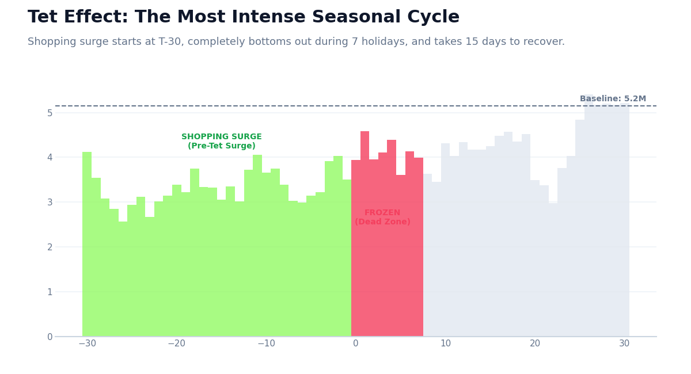
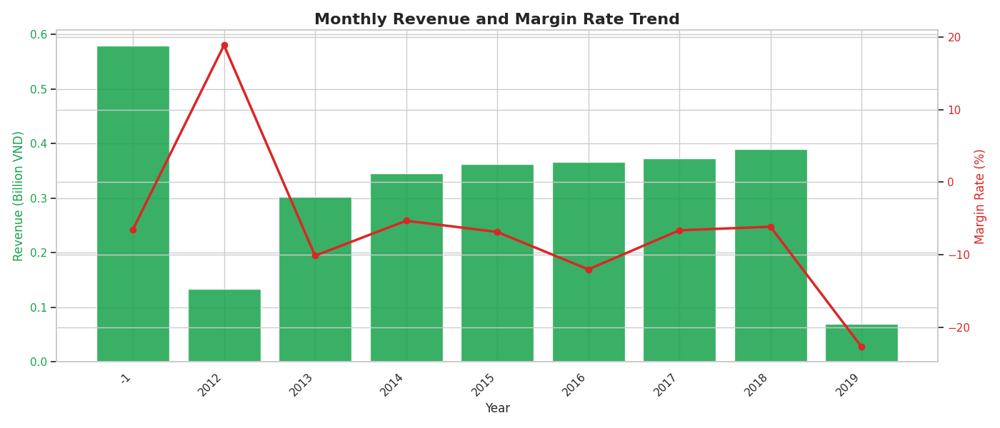

# PART 2 — STRATEGIC FORENSIC AUDIT (REVISED)

**Thesis:** Growth is real, but the operating engine is leaking value. This audit synthesizes four major research directions (01–04) into a unified business diagnosis: top-line revenue masks severe structural leaks in retention, pricing, logistics, and seasonality.

---

## 1. Loyalty Collapse — Direction 02 (Customer Lifecycle)

- **Descriptive:** Next-year retention fell from **64.7% (2012)** to **6.7% (2021)**.
- **Diagnostic:** The business shifted from a sticky, community-brand to a transactional storefront. Later cohorts (post-2018) attract "bargain hunters" with low repeat value.
- **Predictive:** CAC will soon exceed LTV if the trend holds.
- **Prescriptive:** Freeze broad acquisition; redirect spend to lifecycle CRM and loyalty tiers.

---

## 2. Loss Leader Trap — Direction 01 (Product Dominance)

- **Descriptive:** 461 SKUs have margin **≤ 5.5%**. Baskets with these items average **24.2K VND** revenue but suffer a **-1,473 VND** loss.
- **Diagnostic:** Cross-sell fails (+0.22 items/basket); the loss is not subsidized by the upsell.
- **Predictive:** Continued reliance on these SKUs will compress total margin irreparably.
- **Prescriptive:** Discontinue standalone loss-leader selling; gate behind bundling or margin floors.

---

## 3. Inelastic Logistics & Seasonal Stress — Direction 03 (Operational Friction)

- **Descriptive:** Repurchase rate holds flat at **~74%** across 2–14 day delivery windows.
- **Diagnostic:** Customers are inelastic to delivery speed; brand strength overrides logistics delays. Premium 3PL fees are a "silent leak."
- **Predictive:** Express SLAs drain margin with zero LTV benefit.
- **Prescriptive:** Move non-urgent orders to economy tiers. Reinvest savings into **T-30 inventory staging** for seasonal peaks like Tet.

---

## 4. Campaign Paradox — Direction 04 (Financial Dynamics)

- **Descriptive:** **Spring Sale** (Success): +44.2% rev, 10.5% margin. **Year-End Sale** (Failure): -46.3% rev, 1.5% margin.
- **Diagnostic:** Year-end discounting trains customers to wait for markdowns, cannibalizing baseline revenue.
- **Predictive:** Repeating these mechanics will destroy long-term pricing power.
- **Prescriptive:** Eliminate flat markdowns; replace with tiered rewards and a **8% margin floor**.

---

## Supporting Directional Evidence (Appendix)

### A. Product Economics (01)
-  — L/XL bands yield the highest unit profitability.
-  — Newest iterations (suffix > 70) generate 64% more avg revenue per SKU.

### B. Customer Quality (02)
-  — Later acquisition regimes show structurally weaker repeat value.

### C. Operational Leakage (03)
-  — "Wrong size" dominates return reasons across all categories.
-  — Demand surge indexed around Tet holiday.

### D. Financial Baseline (04)
-  — Revenue growth is decoupling from gross profit.

---

## Strategic Imperatives

1. **Protect Margin:** Kill standalone loss-leaders and enforce a margin floor.
2. **Fix Loyalty:** Move from "acquisition at all costs" to "lifecycle CRM."
3. **Capture Peaks:** Use T-30 staging for seasonal cycles.
4. **Optimize Ops:** Downgrade to economy shipping and fix sizing accuracy.
