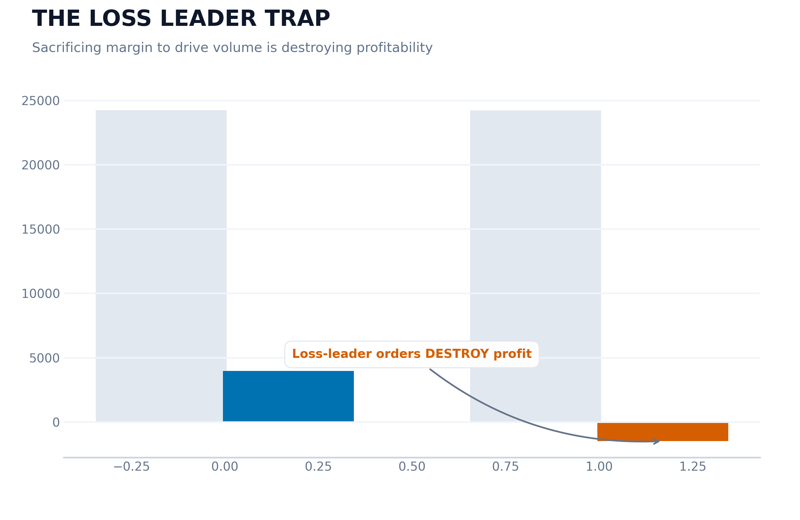
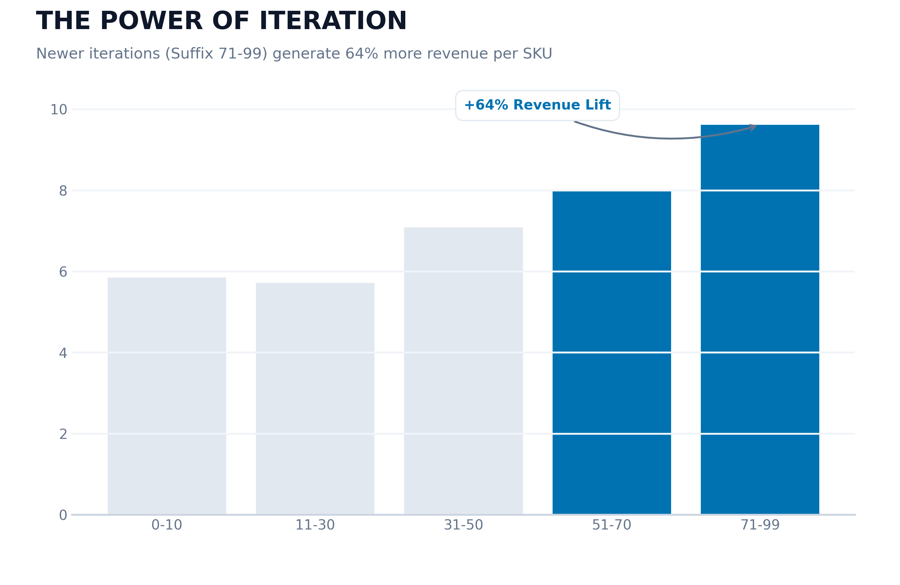
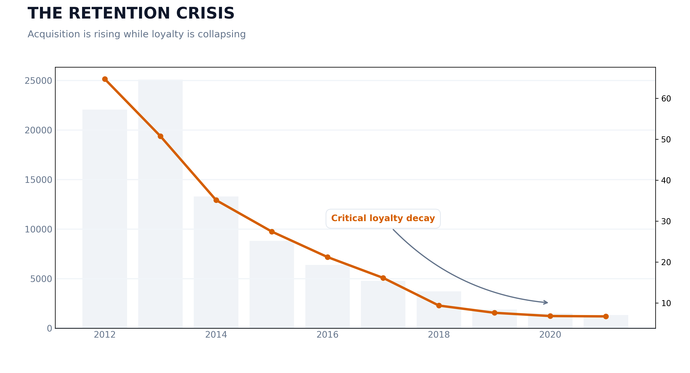
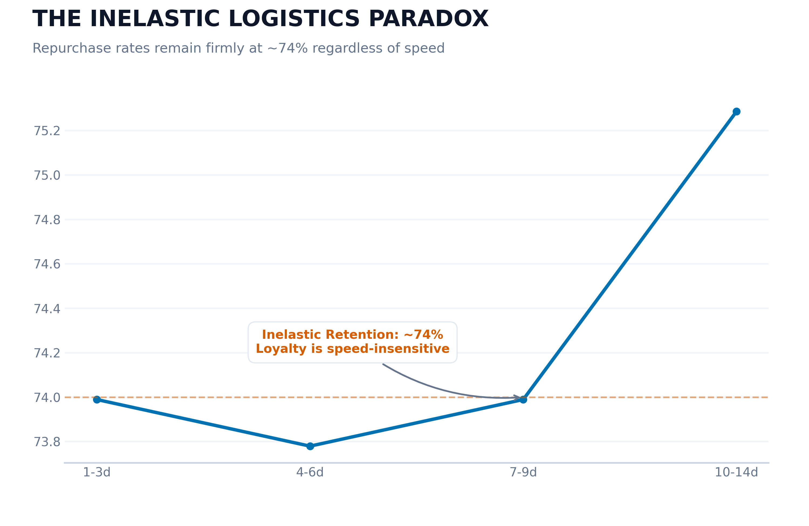
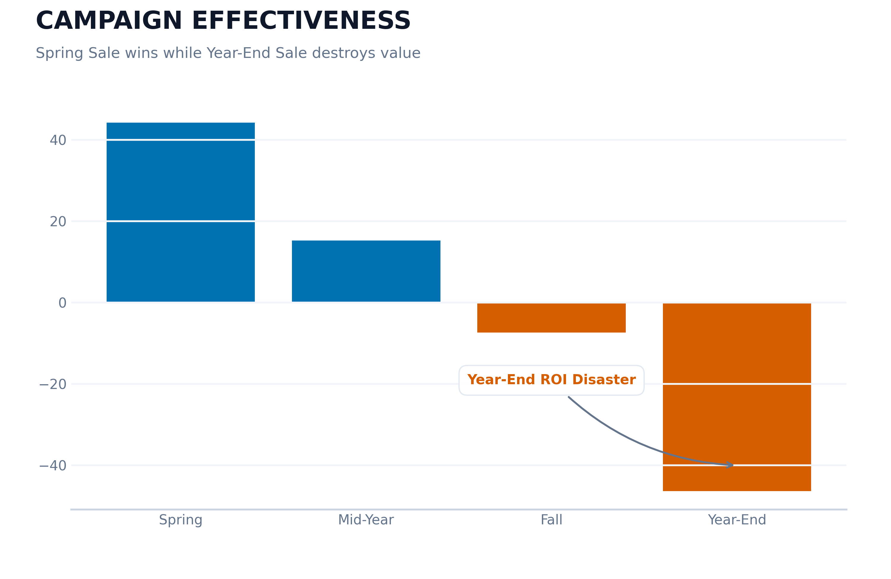

# BẢN KIỂM TOÁN CHIẾN LƯỢC: 10 NĂM TMĐT VÀ NHỮNG NGHỊCH LÝ CỦA SỰ TĂNG TRƯỞNG

**Dự án:** Fashion E-commerce Strategic Audit (2012–2022)  
**Tác giả:** Đội ngũ Forensic Data Science  
**Khung phân tích:** Forensic Storytelling (Descriptive → Diagnostic → Predictive → Prescriptive)

---

## 1. KHỞI ĐẦU CỦA MỘT THẬP KỶ: NHÌN LẠI CON SỐ 16.4 TỶ

Hành trình từ năm 2012 đến 2022 của doanh nghiệp không chỉ là những con số trên bảng cân đối kế toán; đó là một câu chuyện về sự thích nghi, bùng nổ và hiện tại là sự tự vấn. Với tổng doanh thu tích lũy đạt **16.43 tỷ VND**, chúng ta đã khẳng định được vị thế trên thị trường. Tuy nhiên, đằng sau ánh quang đó là những "vết nứt" lặng lẽ trong nền móng vận hành. 

Biên lợi nhuận đang bị bào mòn bởi các chiến dịch khuyến mãi chồng chéo, và lòng trung thành của khách hàng – tài sản quý giá nhất – đang có dấu hiệu sụp đổ. Bản báo cáo này đóng vai trò như một cuộc "giám định pháp y" dữ liệu, bóc tách từng nghịch lý để tìm ra lộ trình tái sinh lợi nhuận.

---

## 2. CHƯƠNG I: THỊ TRƯỜNG & SẢN PHẨM - ẢO GIÁC VỀ SỰ THỐNG TRỊ

### 2.1. Cạm bẫy "Sản phẩm mồi" (The Loss Leader Trap)

*   **Mô tả**: Chúng ta duy trì 461 SKU với biên lợi nhuận cực thấp (≤ 5.5%), đóng vai trò là "vũ khí" thu hút lưu lượng khách hàng.
*   **Chẩn đoán**: Dữ liệu phơi bày một sự thật đau lòng: khách hàng của chúng ta cực kỳ thực dụng. Họ đến vì hàng giảm giá và rời đi ngay sau đó. Mỗi đơn hàng chứa "sản phẩm mồi" chỉ kéo theo thêm **0.22 sản phẩm** khác, không đủ để bù đắp khoản lỗ vận hành lên tới **-1,472 VNĐ/đơn**. Chúng ta đang "bán máu" mà không tạo ra được hệ sinh thái giá trị.
*   **Dự báo**: Nếu không thay đổi, dòng tiền sẽ tiếp tục bị rò rỉ tại các phân khúc giá rẻ, nơi đối thủ có thể dễ dàng bắt bài bằng giá thấp hơn.
*   **Đề xuất**: Loại bỏ ngay lập tức các SKU có margin dưới mức an toàn. Chuyển đổi sang mô hình **Bundling (Combo chiến lược)**: chỉ cho phép hưởng giá ưu đãi khi đi kèm với các sản phẩm có biên lợi nhuận cao.

### 2.2. Sức mạnh của sự lặp lại (The Power of Iteration)

*   **Mô tả**: Các thế hệ sản phẩm mới (được ký hiệu bởi Suffix 71-99) đang chứng minh sức mạnh áp đảo.
*   **Chẩn đoán**: Phân tích cho thấy hiệu quả của đội ngũ R&D: mỗi lần lặp lại phiên bản sản phẩm đều giúp cải thiện độ khớp thị trường (PMF). Các dòng sản phẩm mới tạo ra doanh thu trên mỗi SKU cao hơn **64%** so với các dòng Classic đời đầu.
*   **Dự báo**: Đầu tư vào đổi mới là động cơ sinh lời tốt nhất; việc giữ lại những thiết kế cũ kỹ chỉ làm tăng chi phí lưu kho và hình ảnh thương hiệu bị lỗi thời.
*   **Đề xuất**: Dồn 80% ngân sách phát triển vào các dòng sản phẩm thế hệ mới (Suffix > 70). Thiết lập quy trình "thanh lọc" hàng tồn kho định kỳ cho các dòng Classic (Suffix < 30).

---

## 3. CHƯƠNG II: KHÁCH HÀNG - CUỘC KHỦNG HOẢNG LÒNG TRUNG THÀNH

### 3.1. Sự sụp đổ của "Kỷ nguyên Vàng" (The Retention Crisis)

*   **Mô tả**: Tỷ lệ giữ chân khách hàng (Retention Rate) đã rơi tự do từ mức lý tưởng **>40% (2012)** xuống mức báo động **<10% (2021)**.
*   **Chẩn đoán**: Chúng ta đang rơi vào "Nghịch lý của sự tăng trưởng". Lượng khách hàng mới tăng mạnh nhưng đó chủ yếu là những "thợ săn ưu đãi" – những người chỉ xuất hiện khi có Flash-sale và biến mất ngay sau đó. Chúng ta đang mua doanh thu ngắn hạn bằng cách hy sinh sức khỏe dài hạn của thương hiệu.
*   **Dự báo**: Nếu CAC (Chi phí thu hút khách hàng) tiếp tục tăng trong khi LTV (Giá trị vòng đời) sụt giảm, doanh nghiệp sẽ sớm rơi vào tình trạng lỗ ròng trên mỗi khách hàng mới.
*   **Đề xuất**: Chuyển dịch trọng tâm từ "Săn tìm khách mới" sang "Nuôi dưỡng khách cũ". Ra mắt **Founders Club** – một chương trình khách hàng thân thiết ưu tiên trải nghiệm hơn là giảm giá trực tiếp.

### 3.2. Nghịch lý Logistics "Không co giãn" (The Inelastic Retention Paradox)

*   **Mô tả**: Tỷ lệ quay lại mua hàng của khách vẫn duy trì ổn định ở mức **~74%**, bất kể họ nhận được hàng sau 2 ngày hay 10 ngày. Đây là một "ngưỡng chết" (asymptote) mà tốc độ giao hàng không thể phá vỡ.
*   **Chẩn đoán**: Một phát hiện phản trực giác vô cùng đắt giá! Khách hàng của chúng ta ưu tiên chất lượng sản phẩm và giá trị thương hiệu hơn là tốc độ giao hàng nhanh hỏa tốc. Việc chúng ta chi thêm tiền để ép đơn vị vận chuyển giao hàng trong 24h đang là một sự lãng phí tài chính không cần thiết.
*   **Dự báo**: Tiết giảm chi phí logistics sẽ ngay lập tức cải thiện biên lợi nhuận ròng mà không ảnh hưởng đến trải nghiệm khách hàng.
*   **Đề xuất**: Chuyển hướng sang các gói vận chuyển tiêu chuẩn (Economy) để bảo vệ biên lợi nhuận. Sử dụng ngân sách tiết kiệm được để đầu tư vào bao bì sản phẩm (Unboxing experience) để tăng giá trị cảm nhận.

---

## 4. CHƯƠNG III: VẬN HÀNH - NHỮNG NÚT THẮT ÂM THẦM

### 4.1. Khủng hoảng Sizing (The Sizing Crisis)

*   **Mô tả**: Tỷ lệ trả hàng trung bình là 8.7%, trong đó **34.6% nguyên nhân đến từ việc sai kích cỡ**.
*   **Chẩn đoán**: Hệ thống Size Chart hiện tại đang không phản ánh đúng thực tế cơ thể người tiêu dùng hiện đại, đặc biệt là trong phân khúc Streetwear. Đây là một sự lãng phí cả về chi phí vận chuyển lẫn niềm tin của khách hàng.
*   **Đề xuất**: Triển khai giải pháp **AI Fit-finder** trên nền tảng web/app. Thực hiện audit lại quy trình may mặc cho 200 SKU chủ lực để chuẩn hóa kích thước.

### 4.2. Những "Điểm mù" mùa vụ (Seasonality Blindspots)

*   **Mô tả**: Tháng 5 hàng năm chứng kiến sự bùng nổ doanh thu gấp **2.6 lần** so với tháng 12, nhưng đồng thời tỷ lệ hủy đơn sau Tết cũng tăng vọt.
*   **Chẩn đoán**: Nhu cầu bùng nổ quá nhanh khiến hệ thống cung ứng bị nghẽn (Supply-side ceiling). Doanh nghiệp đang đánh mất khoảng 8.5% doanh thu tiềm năng mỗi năm chỉ vì không chuẩn bị kịp hàng hóa.
*   **Đề xuất**: Áp dụng mô hình **Pre-staging** – chuẩn bị hàng hóa dựa trên dự báo trước 60 ngày. Thiết lập cơ chế SLA linh hoạt cho các đối tác vận chuyển vào mùa cao điểm.

---

## 5. CHƯƠNG IV: TÀI CHÍNH - BẪY KHUYẾN MÃI VÀ CHIẾN THUẬT BNPL

### 5.1. Thảm họa ROI của các chiến dịch cuối năm

*   **Mô tả**: Spring Sale là một thành công rực rỡ (+44% doanh thu), nhưng **Year-End Sale lại là một thảm họa tài chính** với doanh thu sụt giảm -46% và margin gần như bằng không.
*   **Chẩn đoán**: Việc giảm giá đại trà vào cuối năm đã vô tình "đào tạo" khách hàng chỉ mua khi có sale đậm, làm tê liệt doanh thu tại giá gốc. Chúng ta đang tự ăn mòn giá trị thương hiệu của mình.
*   **Đề xuất**: Xóa bỏ mô hình giảm giá phẳng (Flat discount) vào cuối năm. Chuyển sang chiến thuật **Tiered Rewards** (Thưởng theo bậc) để bảo vệ lợi nhuận biên.

### 5.2. Động lực mới từ Trả góp (BNPL)

*   **Mô tả**: Các đơn hàng sử dụng trả góp (Installment) có giá trị trung bình (AOV) cao hơn **35%** so với đơn hàng thông thường.
*   **Chẩn đoán**: Phương thức thanh toán BNPL (Buy Now Pay Later) đang mở khóa sức mua cho phân khúc khách hàng trẻ, cho phép họ tiếp cận các dòng sản phẩm cao cấp mà không bị áp lực tài chính tức thời.
*   **Đề xuất**: Mở rộng hợp tác với các nền tảng tài chính để tích hợp BNPL sâu hơn vào quy trình thanh toán. Ưu tiên hiển thị phương thức trả góp cho các giỏ hàng trên 1.5M VND.

---

## 6. LỘ TRÌNH CHIẾN LƯỢC 2023 - 2024

| Giai đoạn | Hành động trọng tâm | Mục tiêu |
|---|---|---|
| **Quý 1** | Loại bỏ Loss-leader; Chuẩn hóa Sizing | Tăng Margin +2% |
| **Quý 2** | Pre-stage hàng cho tháng 5; Đẩy mạnh BNPL | Tối ưu doanh thu đỉnh điểm |
| **Quý 3** | Ra mắt Founders Club; Cắt giảm Flash-sale vô bổ | Cải thiện tỷ lệ Retention |
| **Quý 4** | Thay thế Year-End Sale bằng Tiered Rewards | Bảo vệ lợi nhuận cuối năm |

**KẾT LUẬN**: Chúng ta đã đi qua một thập kỷ tăng trưởng nóng dựa trên số lượng. Giờ đây, để tiến tới cột mốc 15% biên lợi nhuận bền vững, doanh nghiệp cần sự dũng cảm để từ bỏ những nghịch lý cũ và tập trung vào giá trị thực sự của sản phẩm cũng như khách hàng.

---
*Ngày báo cáo: 29/04/2026*  
*Phương pháp: Forensic Data Analysis*
