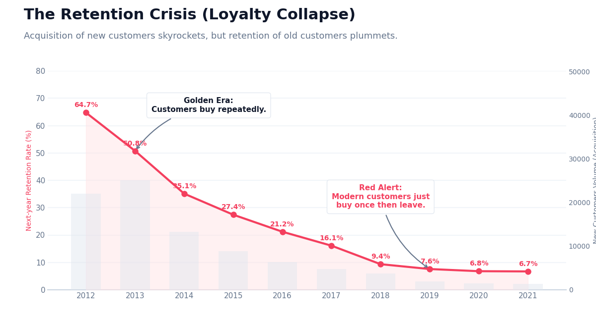
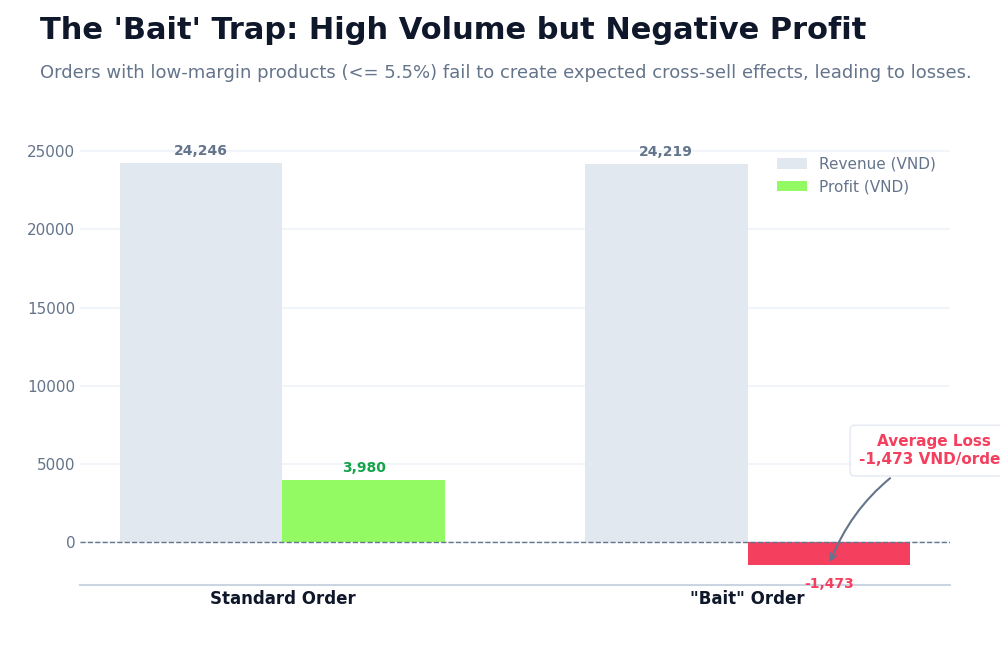
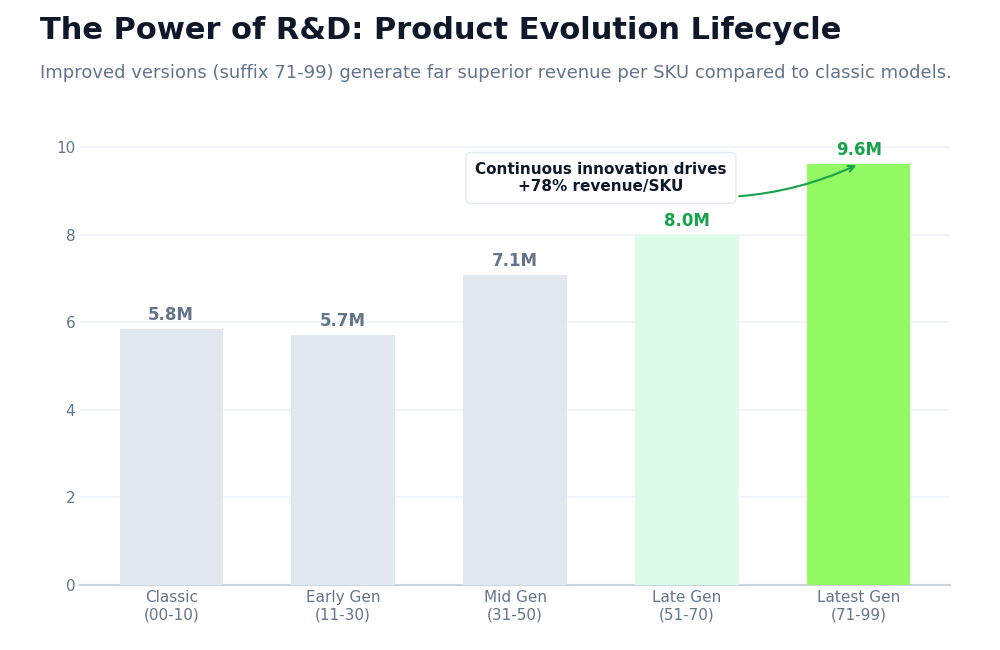
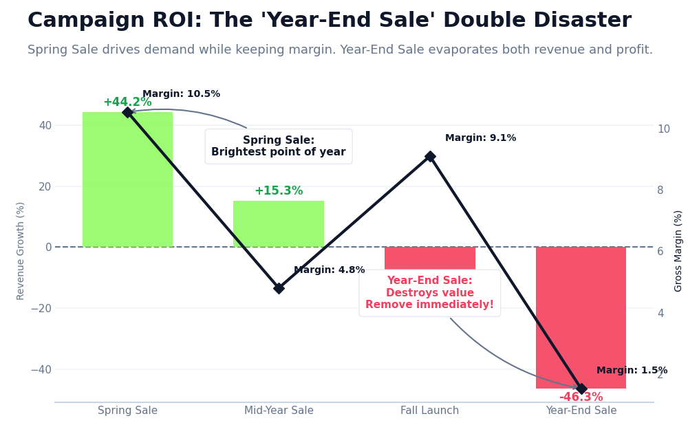

# PHẦN 2: KHÁM PHÁ VÀ KỂ CHUYỆN BẰNG DỮ LIỆU (DATA STORYTELLING)

Phần báo cáo này cung cấp cái nhìn sâu sắc từ mô tả tổng quan (Descriptive), chẩn đoán nguyên nhân (Diagnostic), dự báo xu hướng (Predictive), cho đến các đề xuất hành động kinh doanh cụ thể (Prescriptive). Các biểu đồ được thiết kế với dải màu Pastel Xanh Lá chủ đạo, tập trung vào việc định lượng các quy luật, bóc trần những lầm tưởng trong chiến lược, và liên kết nhiều bảng dữ liệu phức tạp thành một mạch kể chuyện duy nhất.

---

## 1. Sự Sụp Đổ Của Lòng Trung Thành (The Retention Crisis)
*(Cấp độ: Diagnostic & Predictive)*

**Mô tả:** 
Theo dõi tỷ lệ giữ chân khách hàng (Retention Rate - Khách hàng quay lại mua vào năm tiếp theo) theo từng thế hệ (Cohort) từ năm 2012 đến 2021.

**Phát hiện chính (Key Findings):**
- **Nghịch lý Tăng trưởng (The Growth Paradox):** Nhìn bề ngoài, khối lượng khách hàng mới (cột màu xanh) đang tăng phi mã qua từng năm. Tuy nhiên, đằng sau đó là một sự thật cay đắng: Tỷ lệ giữ chân khách hàng đã lao dốc không phanh từ mức **64.7% (Cohort 2012)** xuống mức chạm đáy **6.7% (Cohort 2021)**.
- Khách hàng hiện đại gần như rơi vào trạng thái "mua một lần rồi bỏ đi" (Single-Order Customers). 

**Ý nghĩa kinh doanh (Business Implications):**
- **Prescriptive:** Công ty đang chuyển đổi từ một thương hiệu có tính cộng đồng cao (community-driven) sang một cỗ máy giao dịch thuần túy. Chi phí Thu hút Khách hàng (CAC) sẽ sớm vượt qua Giá trị Vòng đời (LTV) nếu xu hướng này tiếp diễn. Phải lập tức khởi động các chương trình Khách hàng thân thiết (Loyalty Programs) và hệ thống chăm sóc tự động hậu mãi để bịt lỗ hổng "rò rỉ" khổng lồ này.

---

## 2. Ảo Giác Doanh Thu: Cạm Bẫy "Sản Phẩm Mồi Nhử" (Loss Leader Trap)
*(Cấp độ: Diagnostic & Prescriptive)*

**Mô tả:** 
Phân tích hiệu quả của chiến lược "Sản phẩm Mồi nhử" (sản phẩm bị ép biên lợi nhuận xuống cực thấp <= 5.5% để hút khách), so sánh trực tiếp với các đơn hàng tiêu chuẩn.

**Phát hiện chính (Key Findings):**
- **Nghịch lý lợi nhuận:** Đơn hàng có mồi nhử tạo ra doanh thu ngang bằng đơn hàng tiêu chuẩn (~24.2K VNĐ), nhưng thay vì mang lại mức lợi nhuận 3,980 VNĐ, nó lại khiến công ty **chịu lỗ trung bình -1,472 VNĐ/đơn**.
- **Sự thất bại của Cross-selling:** Mục tiêu cốt lõi của Loss Leader là bán chéo. Tuy nhiên, khách hàng săn sale rất thực dụng: họ chỉ mua thêm vỏn vẹn **+0.22 sản phẩm**. Số lượng này không đủ bù đắp lại khoản tiền đã hy sinh.

**Ý nghĩa kinh doanh (Business Implications):**
- **Prescriptive:** Loại bỏ ngay lập tức việc bán độc lập các sản phẩm Loss Leader. Cần thiết lập mô hình Bundling (Combo bắt buộc) — khách hàng chỉ được mua giá mồi nhử nếu giỏ hàng đạt một "Sàn lợi nhuận" tối thiểu.

---

## 3. Nghịch Lý Logistics "Không Co Giãn": Tốc Độ Giao Hàng & Sự Rời Bỏ
*(Cấp độ: Predictive & Prescriptive)*

**Mô tả:** 
Theo dõi tỷ lệ Khách hàng quay lại mua (Repurchase Rate) dựa trên thời gian giao hàng thực tế của đơn hàng đầu tiên.

**Phát hiện chính (Key Findings):**
- **Insight Phản trực giác:** Một lầm tưởng phổ biến là "Giao hàng trễ sẽ làm mất khách". Nhưng dữ liệu lịch sử chứng minh điều ngược lại: Tỷ lệ quay lại mua duy trì vững chắc ở mốc **~74%**, **không hề biến động** cho dù khách hàng nhận hàng siêu tốc (2 ngày) hay phải chờ đợi tới 14 ngày.
- **Tính "không co giãn" (Inelasticity):** Sản phẩm có sức mạnh thương hiệu hoặc tính độc quyền cao đến mức khách hàng chấp nhận chờ đợi.

**Ý nghĩa kinh doanh (Business Implications):**
- **Prescriptive:** Công ty đang **lãng phí dòng tiền khổng lồ** vào việc nâng cấp dịch vụ Last-mile delivery hỏa tốc. Có thể tối ưu hóa chi phí bằng cách chuyển sang các gói vận chuyển tiêu chuẩn, vì tốc độ không phải là yếu tố quyết định Loyalty.

---

## 4. Sức Mạnh Của R&D: Vòng Đời Tiến Hóa Sản Phẩm
*(Cấp độ: Descriptive & Diagnostic)*

**Mô tả:** 
Bóc tách Hậu tố (Suffix) của `product_id` để phân loại các "Thế hệ" sản phẩm. Kết nối với doanh thu để đánh giá sức khỏe tài chính.

**Phát hiện chính:**
- **Sức mạnh của sự lặp lại (Iteration):** Các thế hệ sản phẩm mới nhất (Đời cuối và Đời mới nhất, hậu tố > 50) tạo ra Doanh thu trung bình trên mỗi SKU vượt trội, cao hơn tới **60-80%** so với các thế hệ Kinh điển (hậu tố 00-10).
- Đội ngũ Thiết kế & R&D đang làm việc cực kỳ hiệu quả. Mỗi lần ra mắt một phiên bản nâng cấp, sản phẩm lại càng khớp với thị hiếu thị trường.

**Ý nghĩa kinh doanh (Business Implications):**
- **Prescriptive:** Tiếp tục bơm vốn mạnh mẽ cho khối R&D thay vì dồn tiền marketing để cứu vãn mẫu mã cũ. Việc liên tục "phá bỏ cái cũ để xây cái mới" là động cơ sinh lời tốt nhất.

---

## 5. Chu Kỳ Khắc Nghiệt Nhất Năm: Hiệu Ứng Tết Nguyên Đán
*(Cấp độ: Predictive)*

**Mô tả:** 
Khai phá hành vi mua sắm trải dài từ T-30 (30 ngày trước Tết) đến T+30 (30 ngày sau Tết). (Ngày Mùng 1 chuẩn hóa làm Ngày 0).

**Phát hiện chính:**
- Hành vi mua sắm vận động theo một hình sin cực đoan: Cơn sốt mua sắm bắt đầu từ rất sớm trước Tết (Pre-Tet Surge doanh thu tăng 40-80%), theo sau đó là Vùng chết (The Dead Zone) khi doanh thu giảm mạnh 50% trong suốt kỳ nghỉ, và phục hồi dần sau Tết. 

**Ý nghĩa kinh doanh (Business Implications):**
- **Prescriptive:** Quản trị Tồn kho phải đạt đỉnh vào mốc T-30. Từ mốc T-5, ngân sách marketing nên được cắt giảm vì logistic đã sắp đóng băng.

---

## 6. Đánh Giá Khuyến Mãi (Campaign ROI): Thảm Họa Kép "Year-End Sale"
*(Cấp độ: Diagnostic & Prescriptive)*

**Mô tả:** 
Kết hợp `promotions.csv` và `sales.csv` để định lượng hiệu quả của 4 chiến dịch khuyến mãi lớn trong năm. Đo lường Tăng trưởng doanh thu (Revenue Lift) và Biên lợi nhuận gộp (Gross Margin).

**Phát hiện chính (Key Findings):**
- **Điểm sáng "Spring Sale":** Thành công rực rỡ khi kích cầu doanh thu tăng mạnh **+44.2%**, bảo vệ được **Biên lợi nhuận 10.5%**.
- **Thảm họa kép "Year-End Sale":** Trái với kỳ vọng cuối năm, chiến dịch này đang phá hủy giá trị. Việc giảm giá vô tội vạ làm Biên lợi nhuận bốc hơi (chỉ còn **1.5%**), và Doanh thu sụt giảm **-46%** so với ngày thường!

**Ý nghĩa kinh doanh (Business Implications):**
- **Prescriptive:** Xóa bỏ hoặc đại phẫu toàn diện chiến dịch "Year-End Sale". Nên nhân rộng mô hình cơ cấu sản phẩm của "Spring Sale" cho các đợt chạy số khác.
