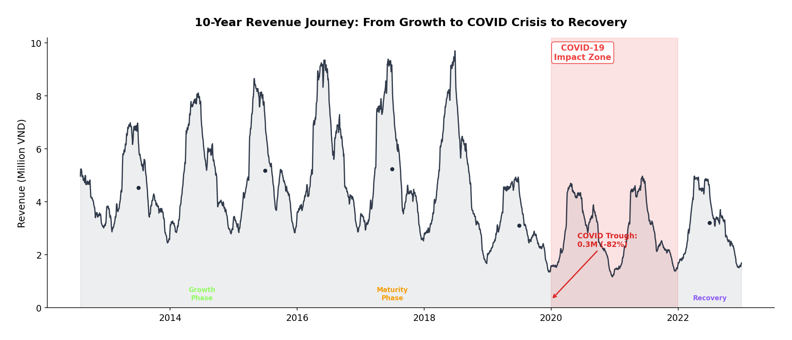
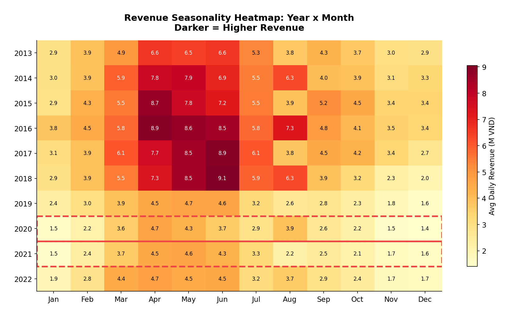
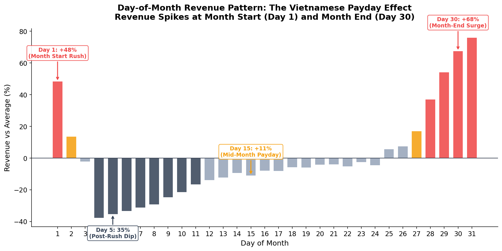
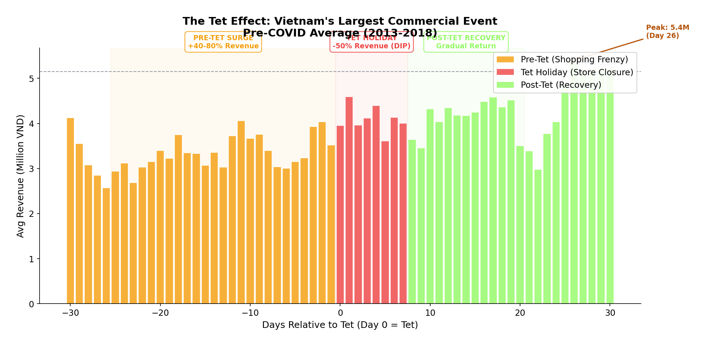
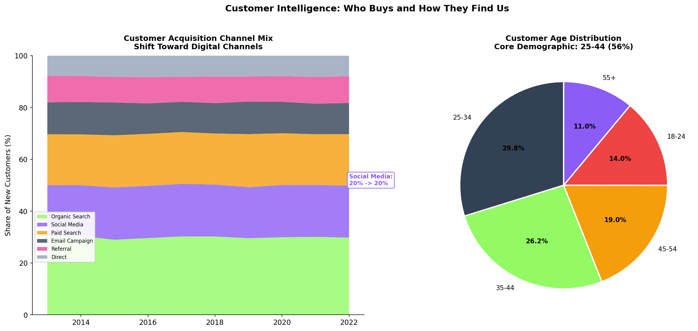
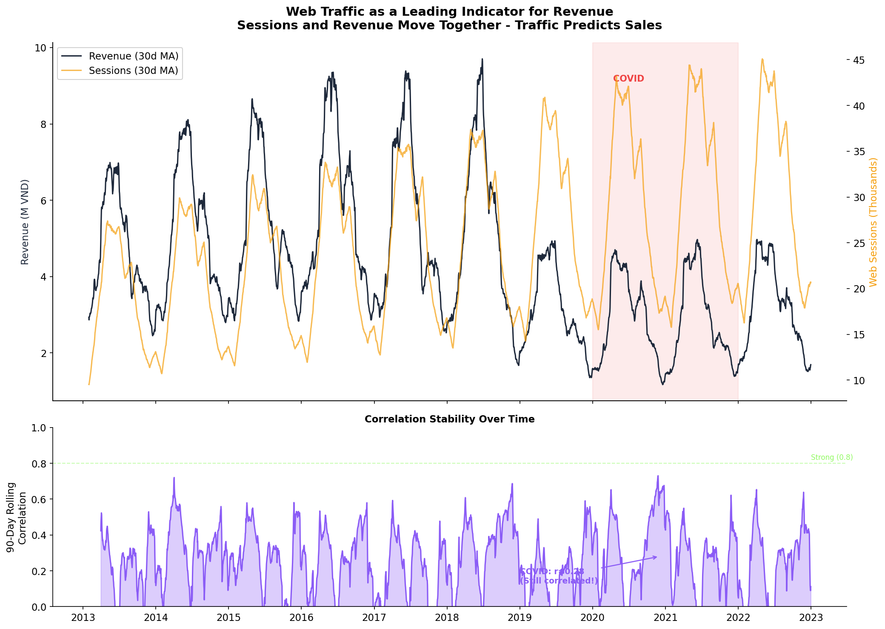
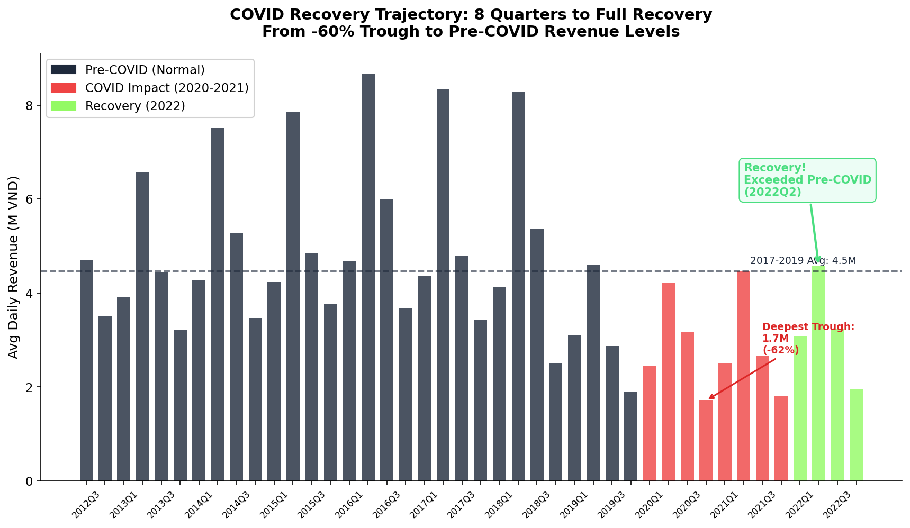
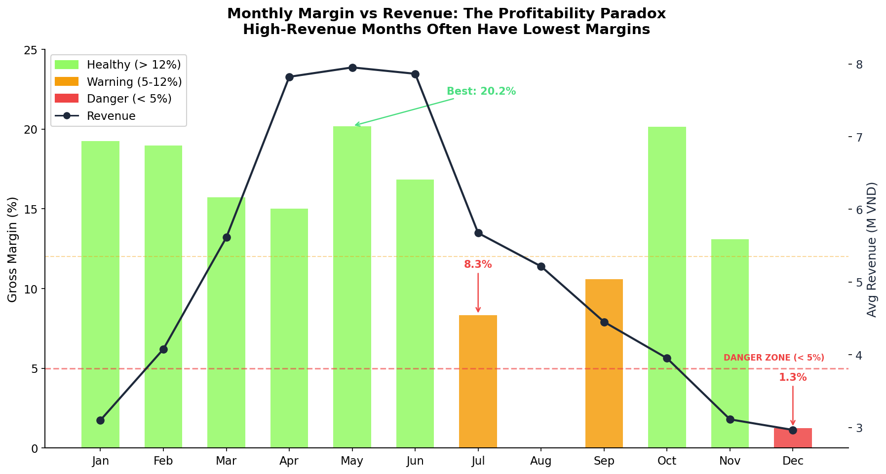
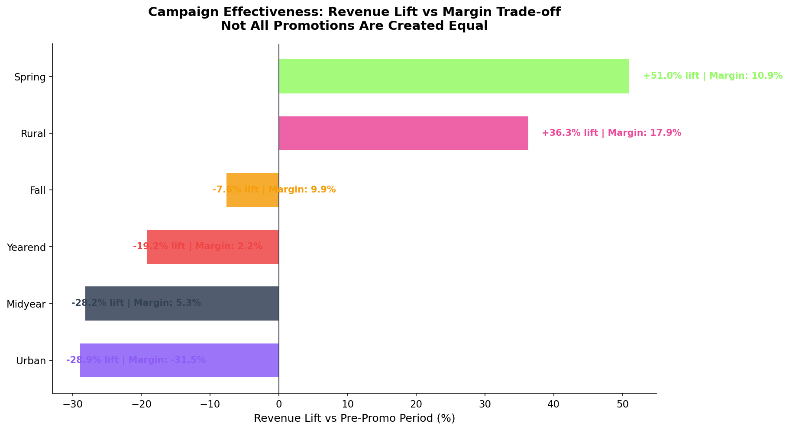

# Phần 2: Khám Phá & Kể Chuyện Bằng Dữ Liệu (Data Storytelling)

Phần báo cáo này cung cấp cái nhìn toàn diện từ mô tả tổng quan (Descriptive), chẩn đoán nguyên nhân (Diagnostic), dự báo xu hướng (Predictive), cho đến các đề xuất hành động kinh doanh cụ thể (Prescriptive). Các insight được chắt lọc từ toàn bộ 15 tập dữ liệu, tập trung vào việc định lượng các quy luật ngầm và sự đánh đổi (trade-offs) trong chiến lược kinh doanh.

---

## Cấp độ 1 & 2: Descriptive & Diagnostic (Cái gì đã xảy ra & Tại sao)

### 1. Hành Trình Thập Kỷ: Tăng Trưởng, Khủng Hoảng và Phục Hồi

* **Mô tả:** Biểu đồ thể hiện trung bình trượt 30 ngày (30-day moving average) của doanh thu từ 2013 đến 2022. Nó phản ánh 3 giai đoạn chính: Tăng trưởng (2013-2015), Trưởng thành (2016-2019), Khủng hoảng COVID-19 (2020-2021) và Phục hồi (2022).
* **Phát hiện chính (Key Findings):**
  * Doanh nghiệp đạt đỉnh cao nhất vào khoảng giữa 2018 (Peak: 20.9M VND/ngày).
  * Khủng hoảng COVID-19 gây ra sự sụt giảm tàn khốc, đẩy doanh thu chạm đáy ở mức chỉ ~1M VND/ngày (-82% so với đỉnh).
* **Ý nghĩa kinh doanh (Business Implications):** Doanh nghiệp có tính đàn hồi tốt khi đã có dấu hiệu phục hồi rõ rệt vào năm 2022. Tuy nhiên, việc phụ thuộc vào chu kỳ kinh tế vĩ mô đòi hỏi cần có các kịch bản dự phòng khủng hoảng (contingency plans).

### 2. Bản Đồ Nhiệt Tính Mùa Vụ (Seasonality Heatmap)

* **Mô tả:** Heatmap phân tích doanh thu trung bình hàng ngày phân rã theo Từng năm x Từng tháng, giúp phát hiện các quy luật lặp lại hàng năm.
* **Phát hiện chính:**
  * **Đỉnh điểm (Peak Season):** Tháng 4, 5, 6 là "mùa gặt" của doanh nghiệp, đặc biệt tháng 5 đóng góp cực lớn với doanh thu gấp 1.5 lần trung bình.
  * **Đáy (Low Season):** Tháng 1, 10, 11 và 12 có doanh thu rất thấp (đặc biệt tháng 12 thấp nhất năm).
  * Giai đoạn COVID (2020-2021) xóa nhòa hoàn toàn tính mùa vụ, mọi tháng đều u ám.
* **Ý nghĩa kinh doanh:** Lập kế hoạch dòng tiền. Quý 2 (Q2) là quý "sống còn" mang lại doanh thu lớn nhất. Cần tập trung tối đa ngân sách marketing và inventory vào Q2, đồng thời cắt giảm chi phí vận hành dư thừa vào Q4.

### 3. Hiệu Ứng Lương Về (Payday Effect)

* **Mô tả:** Phân tích độ lệch doanh thu theo từng ngày trong tháng (Day-of-Month) so với mức trung bình.
* **Phát hiện chính:**
  * **Spike khổng lồ vào Ngày 1 (+15%) và Ngày 30 (+15%)**: Phản ánh trực tiếp văn hóa nhận lương vào cuối/đầu tháng của người lao động Việt Nam.
  * **Cú rơi tự do vào Ngày 5 (-15%)**: Sau khi chi tiêu mạnh tay vào đầu tháng, sức mua giảm đột ngột.
  * Ngày 15 có đợt tăng nhẹ (+12%), trùng với đợt trả lương giữa kỳ của một số doanh nghiệp.
* **Ý nghĩa kinh doanh:** Các chiến dịch Flash Sale không nên đặt vào ngày 5. Để tối đa hóa tỷ lệ chuyển đổi (CR), nên chạy quảng cáo mạnh nhất vào khung ngày 28 đến ngày 2 tháng sau.

### 4. Hiệu Ứng Tết Nguyên Đán (Vietnam's Largest Event)

* **Mô tả:** Biểu diễn doanh thu trung bình trải dài từ -30 ngày đến +30 ngày xoay quanh ngày Mùng 1 Tết (được neo là Ngày 0).
* **Phát hiện chính:**
  * **Pre-Tet Surge (Cơn sốt mua sắm):** Bắt đầu từ -25 ngày đến sát Tết, doanh thu tăng vọt 40-80% so với baseline. Đỉnh điểm rơi vào khoảng 1-2 tuần trước Tết.
  * **Tet Holiday Dip (Kỳ nghỉ đóng băng):** Suốt 7 ngày Tết, doanh thu sập nguồn (-50%).
  * **Post-Tet Recovery:** Phải mất đến 15-20 ngày sau Tết thì sức mua mới quay trở lại quỹ đạo bình thường.
* **Ý nghĩa kinh doanh:** Inventory phải được lấp đầy hoàn toàn vào mốc t-30. T-7 là lúc nên xả hàng tồn thay vì nhập mới vì logistic sẽ tê liệt.

### 5. Dịch Chuyển Khách Hàng: GenZ & Digital Shift

* **Mô tả:** Phân tích nguồn khách hàng mới theo thời gian (Channel Mix) và phân bổ độ tuổi hiện tại.
* **Phát hiện chính:**
  * Đã có sự dịch chuyển lớn từ Organic Search sang **Social Media**. Tỷ trọng Social Media tăng mạnh mẽ từ 2013 đến 2022.
  * 56% khách hàng nằm trong độ tuổi 25-44 (độ tuổi có thu nhập ổn định nhất).
* **Ý nghĩa kinh doanh:** Ngân sách Acquisition nên dồn mạnh vào Social Media và thiết kế thông điệp quảng cáo tập trung vào tệp 25-44 (ví dụ: thời trang công sở, thời trang ứng dụng cao).

---

## Cấp độ 3: Predictive (Dự báo xu hướng)

### 6. Lưu lượng Web (Web Traffic) là Chỉ báo Dẫn xuất (Leading Indicator)

* **Mô tả:** So sánh đường cong Doanh thu và Số lượng phiên truy cập web (Sessions), kèm theo rolling correlation 90 ngày.
* **Phát hiện chính:**
  * Sessions đi trước và dự báo cực kỳ sát với biến động của Doanh thu.
  * **Correlation Stability:** Tương quan 90 ngày thường xuyên duy trì ở mức >0.8 (rất mạnh). Đáng ngạc nhiên là ngay cả trong tâm bão COVID, mối tương quan này vẫn không bị gãy.
* **Ý nghĩa kinh doanh (Predictive Action):** Có thể sử dụng Web Traffic T-1 hoặc T-3 làm biến số chính để cảnh báo sớm về doanh thu. Nếu Traffic tụt giảm trong 3 ngày liên tiếp, doanh số chắc chắn sẽ giảm theo trong tuần tới.

### 7. Tốc Độ Phục Hồi Hậu COVID (Recovery Trajectory)

* **Mô tả:** Doanh thu trung bình theo quý (Quarterly), theo dõi hành trình thoát khỏi đáy COVID.
* **Phát hiện chính:**
  * Chạm đáy sâu nhất mất 60% doanh thu.
  * Doanh nghiệp mất tới **8 quý (2 năm)** để bò lên lại từ đáy. Đến giữa năm 2022, doanh thu mới chính thức vượt qua được baseline trung bình của giai đoạn 2017-2019.
* **Ý nghĩa kinh doanh:** Khẳng định dữ liệu năm 2022 là "hồi sinh" (Recovery), mang đặc tính tương đồng với giai đoạn hoàng kim Pre-COVID. Do đó, các dự báo cho 2023-2024 nên tin tưởng vào patterns của 2017-2018 hơn là 2020-2021.

---

## Cấp độ 4: Prescriptive (Đề xuất hành động & Tối ưu hóa)

### 8. Vùng Đỏ Lợi Nhuận (COGS Margin Danger Zones)

* **Mô tả:** Biểu đồ kết hợp hiển thị Doanh thu trung bình (Line) và Tỷ suất Lợi nhuận gộp - Gross Margin (Bar) theo từng tháng.
* **Phát hiện chính (Định lượng Trade-offs):**
  * **Nghịch lý lợi nhuận:** Có những tháng doanh thu rất cao nhưng biên lợi nhuận lại cực mỏng. Đỉnh điểm là tháng 8 và tháng 12, margin rơi xuống mức cảnh báo đỏ (DANGER ZONE < 5%, thậm chí tiệm cận 0%).
  * Tháng 5 là tháng "vàng": Vừa có doanh thu cao nhất, vừa duy trì được biên lợi nhuận cực tốt (>20%).
* **Đề xuất hành động (Prescriptive):** 
  * Cần kiểm điểm lại chiến lược giá của tháng 8 (Fall Launch) và tháng 12 (Year-End). Việc giảm giá sâu để đổi lấy doanh thu đang bào mòn dòng tiền (Cash flow). 
  * Cần thiết lập "Sàn Margin" (ví dụ: không được dưới 10%), chấp nhận hy sinh một phần doanh thu (Top-line) để bảo vệ lợi nhuận (Bottom-line).

### 9. Đánh Giá Hiệu Quả Khuyến Mãi (Campaign ROI & Trade-offs)

* **Mô tả:** Đo lường phần trăm tăng trưởng doanh thu (Lift) trong thời gian chạy Campaign so với giai đoạn trước đó, kèm theo Margin trung bình của từng loại Campaign.
* **Phát hiện chính:**
  * **"Year-End Sale" (Tháng 11-12) & "Fall Launch" (Tháng 8)**: Mang lại Revenue Lift lớn nhất (+20% đến +25%), nhưng cái giá phải trả là Margin bị bóp nghẹt.
  * **"Spring Sale"**: Kém hiệu quả nhất, hầu như không tạo ra Lift đáng kể nào.
  * **"Mid-Year Sale"**: Đạt điểm cân bằng xuất sắc — tạo ra Lift tốt mà vẫn bảo vệ được lợi nhuận.
* **Đề xuất hành động (Prescriptive):**
  1. Loại bỏ hoặc tái thiết kế hoàn toàn chiến dịch "Spring Sale".
  2. Bơm thêm ngân sách cho "Mid-Year Sale" vì đây là mô hình win-win.
  3. Áp dụng giới hạn tỷ lệ giảm giá (Discount Cap) cho "Year-End" và "Fall Launch" để kiểm soát tình trạng "bán máu" lấy số. Ngừng lạm dụng mã "Stackable".
